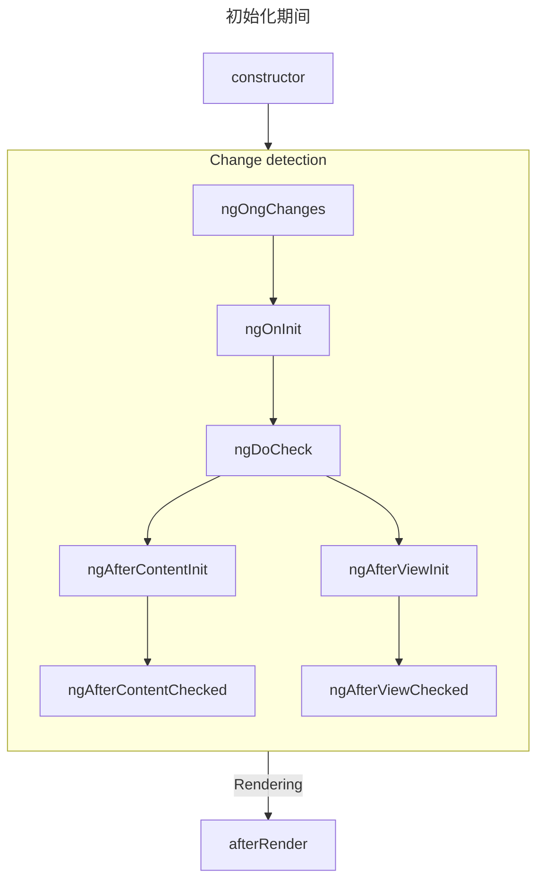
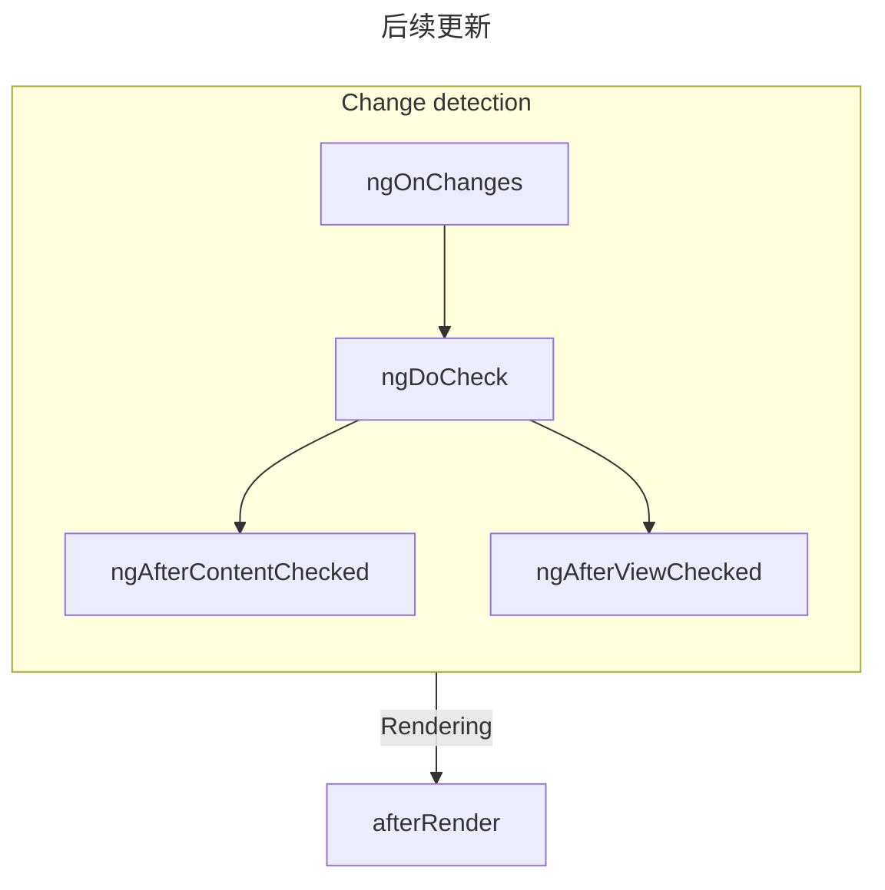
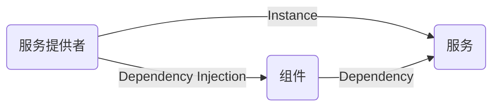
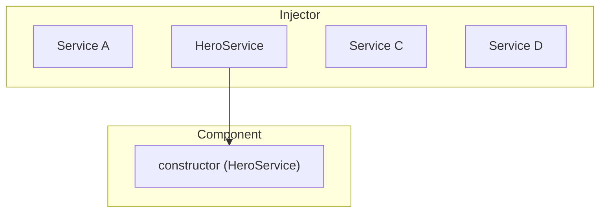

# Angular初步学习笔记01

## Angular核心概念之一：模块（module）

module：不同于Nodejs或ES6中的模块的模块，NG中模块就是一个抽象的容器，用于对组件进行分组。<br>
整个应用初始时有且只有一个主组件：AppComponent<br>

### 惰性加载特性模块

默认情况下，`NgModule` 都是急性加载的。意思是它会在应用加载时尽快加载，所有模块都是如此，无论是否立即要用。对于带有很多路由的大型应用，考虑使用惰性加载 —— 一种按需加载 `NgModule` 的模式。惰性加载可以减小初始包的尺寸，从而减少加载时间。

## Angular核心概念之二：组件（component）

component：是一段可以反复使用的页面片段如页头、轮播、手风琴...<br>
组件（component）=模板（Template）+脚本（Script）+样式（Style）<br>
在NG中任何一个*非独立组件*都必须声明在模块中，*独立组件*不用在模块中声明。*独立组件*是在Angular14引入的，使用时需要注意版本。<br>
1. 创建组件class<br>

   ```typescript
   @Component({
       selector: 'myc01',
       template: '<h2></h2>'
   })

   export class MyC01Component{}
   ```
2. 在某个模块中注册组件class

   ```typescript
   //app.module.ts
   declaration: [
     AppComponent, 
     MyC01Component
   ]
   ```
3. 使用已经注册过的组件

   ```html
   <myc01></myc01>
   ```
Angular提供的创建组件的简化工具，下面两种都行：<br>
```
ng g component 组件名
npx ng g component 组件名
```
nodejs 官方安装的工具：
* npm: 第三方模块的维护工具
* npx: 第三方可执行文件的执行工具

### 组件的生命周期
组件的 生命周期是指发生在组件创建和销毁之间的一系列步骤。每个步骤代表 Angular 渲染组件并随时间检查更新的不同部分的过程。<br>

当 Angular 实例化组件类并渲染组件视图及其子视图时，组件实例的生命周期就开始了。生命周期一直伴随着变更检测，Angular 会检查数据绑定属性何时发生变化，并按需更新视图和组件实例。当 Angular 销毁组件实例并从 DOM 中移除它渲染的模板时，生命周期就结束了。当 Angular 在执行过程中创建、更新和销毁实例时，指令就有了类似的生命周期。<br>

你的应用可以使用生命周期钩子方法来触发组件或指令生命周期中的关键事件，以初始化新实例，需要时启动变更检测，在变更检测过程中响应更新，并在删除实例之前进行清理。<br>

#### 响应生命周期事件<br>
可以通过实现一个或多个 Angular core 库中定义的生命周期钩子接口来响应组件或指令生命周期中的事件。这些钩子让你有机会在适当的时候对组件或指令实例进行操作，比如 Angular 创建、更新或销毁这个实例时。<br>

每个接口都有唯一的一个钩子方法，它们的名字是由接口名再加上 ng 前缀构成的。比如，OnInit 接口的钩子方法叫做 ngOnInit()。如果你在组件或指令类中实现了这个方法，Angular 就会在首次检查完组件或指令的输入属性后，紧接着调用它。<br>
```typescript
@Directive({selector: '[appPeekABoo]'})
export class PeekABooDirective implements OnInit {
  constructor(private logger: LoggerService) { }

  // implement OnInit's `ngOnInit` method
  ngOnInit() {
    this.logIt('OnInit');
  }

  logIt(msg: string) {
    this.logger.log(`#${nextId++} ${msg}`);
  }
}
```
你不必实现所有生命周期钩子，只要实现你需要的那些就可以了。<br>

#### 生命周期的顺序
当你的应用通过调用构造函数来实例化一个组件或指令时，Angular 就会调用那个在该实例生命周期的适当位置实现了的那些钩子方法。<br>

|阶段|方法|总结|
|:---|:---|:---|
|创建|constructor|	标准 JavaScript 类构造函数 。在 Angular 实例化组件时运行。|
|Change|ngOnInit|在 Angular 初始化所有组件输入后运行一次。|
|检测|ngOnChanges|每次组件输入发生变化时运行。|
||ngDoCheck|每次检查此组件是否有变化时运行。|
||ngAfterViewInit|在组件的 视图 初始化后运行一次。|
||ngAfterContentInit|在组件的 内容 初始化后运行一次。|
||ngAfterViewChecked|每次检查组件视图是否有变化时运行。|
||ngAfterContentChecked|每次检查此组件内容是否有变化时运行。|
|渲染|afterNextRender|当所有组件都已渲染到 DOM 时运行一次。|
||afterRender|每次所有组件都渲染到 DOM 时运行。|
|销毁|ngOnDestroy|在组件被销毁前运行一次。|

Angular 会按以下顺序执行钩子方法。可以用它来执行以下类型的操作。<br>
* ngOnInit()<br>
  `ngOnInit` 方法在 Angular 初始化所有组件输入为初始值后运行。组件的 `ngOnInit` 仅运行一次。<br>

  此步骤发生在组件自身的模板初始化 之前。这意味着你可以基于组件的初始输入值更新其状态。<br>

* ngOnChanges()<br>
  `ngOnChanges` 方法在任何组件输入发生变化后运行。<br>

  此步骤发生在组件自身的模板检测 之前。这意味着你可以基于组件的初始输入值更新其状态。<br>

  在初始化期间，第一个 `ngOnChanges` 会在 `ngOnInit` 之前运行。<br>

  检查变化<br>
  `ngOnChanges `方法接受一个 `SimpleChanges` 参数。这个对象是一个 Record，将每个组件输入名称映射到一个 `SimpleChange` 对象。每个 `SimpleChange` 包含输入的前一个值、当前值以及一个标志，指示这是该输入第一次变化。<br>
  ```typescript
  @Component({
  /* ... */
  })
  export class UserProfile {
    @Input() name: string = '';
    ngOnChanges(changes: SimpleChanges) {
      for (const inputName in changes) {
        const inputValues = changes[inputName];
        console.log(`Previous ${inputName} == ${inputValues.previousValue}`);
        console.log(`Current ${inputName} == ${inputValues.currentValue}`);
        console.log(`Is first ${inputName} change == ${inputValues.firstChange}`);
      }
    }
  }
  ```
  如果你为任何输入属性提供了 `alias`， `SimpleChanges` 记录仍然使用 TypeScript 属性名称作为键，而不是别名。<br>

* ngOnDestroy<br>
  ngOnDestroy 方法在组件销毁之前运行一次。当组件不再显示在页面上时，Angular 会销毁组件，比如被 NgIf 隐藏或导航到另一个页面。<br>

  DestroyRef<br>
  作为 `ngOnDestroy` 方法的替代，你可以注入一个 `DestroyRef` 实例。你可以通过调用 `DestroyRef` 的 `onDestroy` 方法注册一个回调，以在组件销毁时调用。<br>
  ```typescript
  @Component({
  /* ... */
  })
  export class UserProfile {
    constructor(private destroyRef: DestroyRef) {
      destroyRef.onDestroy(() => {
        console.log('UserProfile destruction');
      });
    }
  }
  ```
  你可以将 `DestroyRef` 实例传递给组件外的函数或类。如果你有其他代码需要在组件销毁时运行一些清理行为，可以使用这种模式。<br>

  你也可以使用 `DestroyRef` 将设置代码与清理代码保持接近，而不是将所有清理代码放在 `ngOnDestroy` 方法中。<br>
* ngDoCheck<br>
  `ngDoCheck` 方法在 Angular 每次检查组件模板的变化之前运行。<br>

  你可以使用这个生命周期钩子手动检查 Angular 正常变更检测之外的状态变化，手动更新组件的状态。<br>

  这个方法运行非常频繁，会显著影响页面性能。尽量避免定义这个钩子，只有在没有其他选择时才使用。<br>

  在初始化期间，第一个 `ngDoCheck` 会在 `ngOnInit` 之后运行。<br>
* ngAfterViewInit<br>
  `ngAfterContentInit` 方法在组件内部嵌套的所有子元素（其 内容）初始化后运行一次。<br>
  你可以使用此生命周期钩子来读取 内容查询的结果。虽然可以访问这些查询的已初始化状态，但尝试在此方法中更改任何状态会导致 ExpressionChangedAfterItHasBeenCheckedError.<br>
* ngAfterViewChecked<br>
  `ngAfterViewChecked` 方法在组件模板（其 视图）中的子元素每次被检查变化时运行。<br>
  这个方法运行非常频繁，会显著影响页面性能。尽量避免定义这个钩子，只有在没有其他选择时才使用。<br>
  虽然可以在此处访问 视图查询的更新状态，但尝试在此方法中更改任何状态会导致 ExpressionChangedAfterItHasBeenCheckedError。<br>
* ngAfterContentChecked<br>
  `ngAfterContentChecked` 方法在组件内部嵌套的子元素（其 内容）每次被检查变化时运行。<br>
  这个方法运行非常频繁，会显著影响页面性能。尽量避免定义这个钩子，只有在没有其他选择时才使用。<br>
  虽然可以在此处访问 内容查询的更新状态，但尝试在此方法中更改任何状态会导致 ExpressionChangedAfterItHasBeenCheckedError。<br>
* afterRender 和 afterNextRender<br>
  `afterRender` 和 `afterNextRender` 函数允许你注册一个 渲染回调，在 Angular 完成将 所有组件渲染到 DOM 后调用。<br>
  这些函数与本指南中描述的其他生命周期钩子不同。它们不是类方法，而是接受回调的独立函数。渲染回调的执行不绑定到任何特定组件实例，而是应用范围的钩子。<br>
  你可以使用渲染回调来执行手动 DOM 操作。请参见 在 Angular 中使用 DOM API以获取有关操作 DOM 的指导。<br>

  渲染回调不会在服务器端渲染或构建时预渲染期间运行。<br>

  afterRender 阶段
  使用 `afterRender` 或 `afterNextRender` 时，可以选择性地指定一个 phase。该阶段让你可以控制 DOM 操作的顺序，在 写操作之前进行 读操作，以最小化 布局抖动。<br>
  ```typescript
  import {Component, ElementRef, afterNextRender, AfterRenderPhase} from '@angular/core';
  @Component({...})
  export class UserProfile {
    private elementHeight = 0;
    constructor(elementRef: ElementRef) {
      const nativeElement = elementRef.nativeElement;
      // Use the `Write` phase to write to a geometric property.
      afterNextRender(() => {
        nativeElement.style.padding = computePadding();
      }, {phase: AfterRenderPhase.Write});
      // Use the `Read` phase to read geometric properties after all writes have occurred.
      afterNextRender(() => {
        this.elementHeight = nativeElement.getBoundingClientRect().height;
      }, {phase: AfterRenderPhase.Read});
    }
  }
  ```
  有四个阶段，按以下顺序运行：<br>
  |阶段|说明|
  |:---|:---|
  |`EarlyRead`|使用此阶段读取任何会影响布局的 DOM 属性和样式（严格必要的后续计算）。如有可能，避免使用此阶段，优选 `Write` 和 `Read` 阶段。|
  |`MixedReadWrite`|默认阶段。用于需要同时读取和写入会影响布局的属性和样式的任何操作。如有可能，避免使用此阶段，优选明确的 `Write` 和 `Read` 阶段。|
  |`Write`|	使用此阶段写入会影响布局的 DOM 属性和样式。|
  |`Write`|使用此阶段来读取任何影响布局的 DOM 属性。|

Lifecycle 接口<br>
Angular 为每个生命周期方法提供了一个 TypeScript 接口。你可以选择性地导入并 实现 这些接口，以确保你的实现没有任何拼写错误或拼写错误。<br>

每个接口的名称与对应的方法名称相同，不包含 `ng` 前缀。例如， `ngOnInit` 的接口是 `OnInit`。<br>

执行顺序<br>
以下图表显示 Angular 生命周期钩子的执行顺序。<br>



指令排序<br>
当你在一个元素上放置一个或多个指令与组件一起，无论是在模板中还是使用 `hostDirectives` 属性，框架不保证在单个元素上的组件和指令之间的任何生命周期钩子的顺序。永远不要依赖于观察到的顺序，因为这在后续版本的 Angular 中可能会发生变化。

### 组件父子之间信息传递
父组件向子组件传递数据，子组件向父组件传递数据，子组件向子组件传递数据，父组件向父组件传递数据。<br>
* 父向子传递
  父组件通过“子组件的自定义属性”向下传递数据给子组件
  * 父组件创建数据，parent.ts<br>
    ```typescript
    public userName = '张三';
    ```
  * 父组件将自己的数据绑定给子组件的属性，parent.html<br>
    ```html
    <child2-component [child2Name]="userName"></child2-component>
    ```
  * 子组件定义扩展属性，child2.ts<br>
    ```typescript
    // 声明为输入属性
    @Input()
    public child2Name: string;
    ```
  * 子组件使用自定义属性，child2.html<br>
    ```html
    <p>{{child2Name}}</p>
    ```

* 子向父传递
  子组件通过触发特定的事件（其中携带者数据），向上传递数据给父组件（父组件提供事件处理方法）<br>
  * child1.ts<br>
    自定义事件发射器--输出型<br>
    ```typescript
    @Output()
    public child1Event = new EventEmitter();

    // 在特定时刻发射事件
    this.child1Event.emit('子组件向父组件传递数据');
    ```
  * parent.html<br>
    ```html
    <child1-component (child1Event)="parentEvent($event)"></child1-component>
    ```
  * parent.ts<br>
    ```typescript
    public parentEvent(event: string) {
      // event 为子组件向父组件传递的数据
      console.log(event);
    }
    ```

父子组件传递数据的简便方法：父亲直接使用子组件的引用<br>
使用#为子组件声明识别符<br>
```html
<div #child1></div>
<child2-component #child2></child2-component>
```
```typescript
@ViewChild('child1', {static: true})
public child1: ElementRef;

@ViewChild('child2', {static: true})
public child2: ElementRef;
```
>提示：ViewChild装饰器用于将子组件识别符与某个属性关联起来，第一个参数必须是已经存在的子组件识别符（不带#），第二个参数static与指定该组件是否为“静态组件”--不会时有时无的组件<br>
>注意：通过“ViewChild-视图子组件“方式，父组件可以获得任一子组件中的任意数据--一定程度上违反了”最少知识法则“<br>

## Angular核心概念之三：数据绑定（binding）

Angular 根据数据流的方向提供三种类型的数据绑定：
* 从源到视图
* 从视图到源
* 双向，从视图到源再到视图

[]、()、[()] 这些绑定标点以及前缀，用来指定数据流的方向
* 使用 [] 从源绑定到视图
* 使用 () 从视图绑定到源
* 使用 [()] 进行双向绑定，将视图绑定到源再绑定到视图

将表达式或语句放在双引号 "" 中，等号的右侧

模板表达式类似于 JavaScript 表达式。许多 JavaScript 表达式都是合法的模板表达式，但以下例外。<br>
你不能使用那些具有或可能引发副作用的 JavaScript 表达式，包括：
* 赋值（=, +=, -=, ...）
* 运算符，比如 new、typeof 或 instanceof 等。
* 链接表达式;或，
* 自增和自减运算符：++ 和 --
* 一些 ES2015+ 版本的运算符

和 JavaScript 语法的其它显著差异包括：
* 不支持位运算，比如 | 和 &
* 新的模板表达式运算符，比如 |

Angular中的数据绑定
* 插值（HTML绑定）
  ```typescript
  {{NG表达式}}
  ```
  NG表达式可以执行的代码
  * 算术运算？--可以
  * 比较运算？--可以
  * 逻辑运算？--可以
  * 三目运算？--可以
  * 调用函数？--可以
  * 创建对象？--不可以
  * JSON序列化？--不可以
* 属性（Property）绑定
  ```html
  
  ```
  属性绑定通常赋值为变量，如果赋值为常量（如字符串常量）必须用单引号''扩起来
* 事件绑定
  ```typescript
  (click)="addValue()"
  ```
  事件名用（）括起来，处理函数名后必须跟（）
* 指令绑定
* 基于 ngModel 的双向数据绑定

## Angular核心概念之四：指令系统（directive）

> Vue.js中的常用指令：
> v-on、v-bind、v-for、v-if、v-show、v-hide、v-text/html...

指令是为 Angular 应用程序中的元素添加额外行为的类。使用 Angular 的内置指令，你可以管理表单、列表、样式以及要让用户看到的任何内容。<br>
### 指令类型

Angular 指令的不同类型如下：
|指令类型|详情|
|:---:|:---|
|组件|与模板一起使用。这种类型的指令是最常见的指令类型|
|属性型指令|改变元素、组件或其他指令的外观或行为|
|结构型指令|通过添加和移除DOM元素来改变DOM布局|

1. 组件指令

   NG中Component继承自Directive

2. 结构型指令

   会影响DOM树的结构，必须使用*开头，如*ngFor、*ngIf

3. 属性型指令

   不会影响DOM树的结构，只是影响元素外观或行为，必须用[]括起来，如ngStyle、ngClass
### 指令绑定

1. 循环绑定

   *ngFor
   ```typescript
   <element *ngFor="let 临时变量 of 列表集合"></element>
   <element *ngFor="let 临时变量 of 列表集合; let i=index"></element>
   <element *ngFor="let 临时变量 of 列表集合; index as i"></element>
   ```
2. 选择绑定

   *ngIf
   ```typescript
   <element *ngIf="布尔表达式"></element>
   <element *ngIf="布尔表达式; else ELSE块编号"></element>
   <ng-template #ELSE块编号>
     <ANY>
       ...
     </ANY>
   </ng-template>
   ```
   说明：如果布尔表达式为ture则显示内容，否则当前元素从DOM树上删除
3. 样式绑定

   * ngStyle
     ```typescript
     <some-element [ngStyle]="object"></some-element>
     ```
     说明：ngStyle绑定的值必须是一个对象！对象属性就是CSS样式名
   * ngClass
     ```typescript
     <some-element [ngClass]="object"></some-element>
     ```
     说明：ngClass绑定的值必须是一个对象！对象属性就是CSS class名，属性值为ture/false，true的话该class就出现；否则class不出现
4. 特殊的选择绑定

   ```typescript
   <container-element [ngSwitch]="switch_expression">
     <some-element *ngSwitchCase="match_expression_1">...</some-element>
       ...
     <some-element *ngSwitchDefault>...</some-element>
   </container-element>
   ```
5. 双向数据绑定指令

   * ngModel<br>
     方向一：Model => View，模型变则视图变，用[]绑定<br>
     方向二：View =>，视图（表单元素）变则模型变，用()绑定<br>
     ```typescript
     <input/select/textarea [(ngModel)] = "uname">
     ```
     注意：ngModule不在**CommonModule**模块中，而在**FormsModule**模块中，使用之前必须先导入该模块<br>
     如果要想直接监视模型数据改变，可以绑定ngModelChange事件，支持input事件的Angular版本也可以绑定input事件<br>
### 自定义指令

创建指令的简单工具
```
ng g directive 指令名
```
自定义指令都是作为元素属性来使用的，selector应该是指令名<br>
```typescript
<element 指令名></element>
```
## Angular核心概念之五：管道（Pipe）

管道是简单的函数，在 模板表达式中使用，接受一个输入值并返回一个转换后的值。管道很有用，因为你可以在整个应用程序中使用它们，只需声明每个管道一次。 例如，你可以使用管道将日期显示为 1988年4月15日，而不是原始的字符串格式。<br>
在*Angular2*之前，管道叫做过滤器<br>
Filter过滤器，用于在View中呈现数据时显示为另一种格式；过滤器的本质是一个函数，接收原始数据转换为新的格式进行输出<br>
```typescript
function(oldVal) {
  ...
  return newVal;
}
```

使用过滤器`{{e.salary | 过滤器名}}`<br>

### 内置管道

* lowercase<br>
  把文本转换成全小写形式。<br>
  输入值类型`string`<br>
  ```typescript
  {{ value_expression | lowercase }}
  ```
* uppercase<br>
  把文本转换成全大写形式。<br>
  输入值类型`string`<br>
  ```typescript
  {{ value_expression | uppercase }}
  ```
* titlecase<br>
  把文本转换成标题形式。 把每个单词的第一个字母转成大写形式，并把单词的其余部分转成小写形式。 单词之间用任意空白字符进行分隔，比如空格、Tab 或换行符。<br>
  输入值类型`string`<br>
  ```typescript
  {{ value_expression | titlecase }}
  ```
* slice<br>
  从一个 Array 或 String 中创建其元素一个新子集（slice）。只显示字符串的一部分<br>
  当操作空白值时，该管道也会返回空白值。<br>
  当操作 Array 时，返回的 Array 始终是一个副本 —— 即使返回了所有元素也是一样。<br>
  输入值类型`string | readonly T[]`<br>
  ```typescript
  {{ value_expression | slice : start [ : end ] }}
  ```

* json<br>
  把一个值转换成 JSON 字符串格式。在调试时很有用。<br>
  输入值类型`any`<br>
  ```typescript
  {{ value_expression | json }}
  ```
* number<br>
  根据数字选项和区域设置规则格式化值。区域设置确定组的大小和分隔符、小数点字符和其他特定于区域设置的配置。<br>
  输入值类型`string | number`<br>
  ```typescript
  {{ value_expression | number [ : digitsInfo [ : locale ] ] }}
  ```
  |参数名|类型|说明|
  |:---:|:---:|:---|
  |digitsInfo|string|可选值。默认值为 undefined|
  |locale|string|可选值。默认值为 undefined|
  * digitsInfo<br>
    值的十进制表示由 digitsInfo 参数指定，格式如下：
    ```typescript
    {minIntegerDigits}.{minFractionDigits}-{maxFractionDigits}
    ```
    * minIntegerDigits<br>
      小数点前的最小整数位数。默认值为 1。<br>
    * minFractionDigits<br>
      小数点后的最小位数。默认值为 0。<br>
    * maxFractionDigits<br>
      小数点后的最大位数。默认值为 3。<br>

    如果格式化的值被截断，将使用“to-nearest”方法将其四舍五入：<br>
    ```typescript
    {{3.6 | number: '1.0-0'}}
    <!--will output '4'-->

    {{-3.6 | number:'1.0-0'}}
    <!--will output '-4'-->
    ```
  * locale<br>
    locale 将根据区域设置规则格式化值。区域设置确定组的大小和分隔符、小数点字符和其他特定于区域设置的配置。<br>
    未提供时，使用 LOCALE_ID 的值，默认为 en-US。<br>
* currency<br>
  将数字转换为货币字符串，根据确定组大小和分隔符、小数点字符和其他特定于区域设置的配置的区域设置规则进行格式化。<br>
  输入值类型`string | number`<br>
  ```typescript
  {{ value_expression | currency [ : currencyCode [ : display [ : digitsInfo [ : locale ] ] ] ] }}
  ```
  |参数名|类型|说明|
  |:---:|:---:|:---|
  |currencyCode|string|可选值。默认值为 this._defaultCurrencyCode。|
  |display|string or boolean|货币指示器的格式。可选值。默认值为 'symbol'。|
  |digitsInfo|string|十进制表示选项。可选值。默认值为 undefined。|
  |locale|string|可选值。默认值为 undefined。|
  
  * display<br>
    货币指示器的格式。以下之一：<br>
    * code<br>
      显示代码（例如 USD）。
    * symbol（默认）<br>
      显示符号（例如 $）。<br>
    * symbol-narrow<br>
      对有两个货币符号的区域设置使用窄符号。例如，加元 CAD 的符号是 CA$ 和符号-narrow $。如果此区域设置没有窄符号，则使用此区域设置的标准符号。<br>
    * 字符串<br>
      使用给定的字符串值，而不是代码或符号。例如，空字符串将抑制货币 & 符号。
    * 布尔值（在 v5 中标记为已弃用）<br>
      symbol 为 true，code 为 false。<br>
  * digitsInfo<br>
    十进制表示选项，由以下格式的字符串指定：<br>
    * minIntegerDigits<br>
      小数点前的最小整数位数。默认为 1。<br>
    * minFractionDigits<br>
      小数点后的最小位数。默认为 2。
    * maxFractionDigits<br>
      小数点后的最大位数。默认为 2。如果未提供，则该数字将根据ISO 4217指定的内容使用适当的位数格式化。例如，加元有 2 位，而智利比索没有。<br>
* date<br>
  根据区域设置规则格式化日期值。<br>
  输入值类型`string | number | Date`<br>
  ```typescript
  {{ value_expression | date [ : format [ : timezone [ : locale ] ] ] }}
  ```
  |参数名|类型|说明|
  |:---:|:---:|:---|
  |format|string|可选值。默认值为 undefined。|
  |timezone|string|可选值。默认值为 undefined。|
  |locale|string|可选值。默认值为 undefined。|

  DatePipe 仅当检测到输入值发生纯粹更改时才会执行。纯更改是对原始输入值的更改（例如 String、Number、Boolean 或 Symbol），或者是更改的对象引用（例如 Date、Array、Function 或 Object）。<br>

  请注意，更改 Date 对象不会导致管道再次渲染。为确保管道被执行，你必须创建一个新的 Date 对象。<br>

  Angular 只自带了 en-US 区域的数据。要想在其它语言中对日期进行本地化，你必须导入相应的区域数据。 欲知详情，参见 I18n guide。<br>

  可以通过将格式化值的时区作为管道的第二个参数传入，或通过 DATE_PIPE_DEFAULT_TIMEZONE 注入令牌设置默认值来指定格式化值的时区。作为第二个参数传入的值优先于使用注入令牌定义的值。<br>
  当输入值发生变化时，该管道的结果并不会改变。如果不想在每个变更检测周期中都强制重新格式化该日期，请把日期看做一个不可变对象， 当需要让该管道重新运行时，请赋给它一个新的对象，以更改它的引用。<br>

  预定义的格式选项<br>
  |选项|等效于|示例（用 en-US语言环境提供）|
  |:---:|:---|:---|
  |'short'|'M/d/yy, h:mm a'|6/15/15, 9:03 AM|
  |'medium'|'MMM d, y, h:mm:ss a'|Jun 15, 2015, 9:03:01 AM|
  |'long'|'MMMM d, y, h:mm:ss a z'|June 15, 2015 at 9:03:01 AM GMT+1|
  |'full'|'EEEE, MMMM d, y, h:mm:ss a zzzz'|Monday, June 15, 2015 at 9:03:01 AM GMT+01:00|
  |'shortDate'|'M/d/yy'|6/15/15|
  |'mediumDate'|'MMM d, y'|Jun 15, 2015|
  |'longDate'|'MMMM d, y'|June 15, 2015|
  |'fullDate'|'EEEE, MMMM d, y'|Monday, June 15, 2015|
  |'shortTime'|'h:mm a'|9:03 AM|
  |'mediumTime'|'h:mm:ss a'|9:03:01 AM|
  |'longTime'|'h:mm:ss a z'|9:03:01 AM GMT+1|
  |'fullTime'|'h:mm:ss a zzzz'|9:03:01 AM GMT+01:00|

  自定义格式选项<br>
  你可以用符号构造格式字符串来指定日期时间值的组成部分，如下表所述。格式详细信息取决于区域设置。标有 (*) 的字段仅在给定区域设置的额外数据集中可用。<br>

  |字段类型|格式|说明|示例值|
  |:---:|:---|:---|:---|
  |时代|G、GG和GGG|缩写|AD|
  ||GGGG|宽|公元|
  ||GGGGG|窄|A|
  |年份|y|数字: 最小位数|2, 20, 201, 2017, 20173|
  ||yy|数字: 2位数 + 补零|02, 20, 01, 17, 73|
  ||yyy|数字: 3位数 + 补零|002, 020, 201, 2017, 20173|
  ||yyyy|数字: 4位数或更多 + 补零|0002, 0020, 0201, 2017, 20173|
  |ISO周编号年份|Y|数字: 最小位数|2, 20, 201, 2017, 20173|
  ||YY|数字: 2位数 + 补零|02, 20, 01, 17, 73|
  ||YYY|数字: 3位数 + 补零|002, 020, 201, 2017, 20173|
  ||YYYY|数字: 4位数或更多 + 补零|0002, 0020, 0201, 2017, 20173|
  |月份|M|数字: 1位数|9, 12|
  ||MM|数字: 2位数 + 补零|09, 12|
  ||MMM|缩写|九月|
  ||MMMM|宽|九月|
  ||MMMMM|窄|S|
  |月份独立显示|L|数字: 1位数|9, 12|
  ||LL|数字: 2位数 + 补零|09, 12|
  ||LLL|缩写|九月|
  ||LLLL|宽|九月|
  ||LLLLL|窄|S|
  |ISO年份的周数|w|数字: 最小位数|1... 53|
  ||ww|数字: 2位数 + 补零|01... 53|
  |月份的周数|W|数字: 1位数|1... 5|
  |日期|d|数字: 最小位数|1|
  ||dd|数字: 2位数 + 补零|01|
  |星期|E, EE & EEE|缩写|周二|
  ||EEEE|宽|星期二|
  ||EEEEE|窄|T|
  ||EEEEEE|简短|周二|
  |独立星期|c, cc|数字: 1位数|2|
  ||ccc|缩写|周二|
  ||cccc|宽|星期二|
  ||ccccc|窄|T|
  ||cccccc|简短|周二|
  |时段|a, aa & aaa|缩写|上午/下午或AM/PM|
  ||aaaa|宽（当缺失时回退到a)|上午/下午
  ||aaaaa|窄|上午/下午|
  |时段*|B, BB & BBB|缩写|中午|
  ||BBBB|宽|上午、下午、午夜、正午、早晨、下午、傍晚、晚上|
  ||BBBBB|窄|md|
  |时段独立*|b，bb 和 bbb	缩写	中午|
  ||bbbb|宽|上午、下午、午夜、正午、早晨、下午、傍晚、晚上|
  ||bbbbb|窄|md|
  |小时 1-12|h|数字: 最小位数|1, 12|
  ||hh|数字: 2位数 + 补零|01, 12|
  |小时 0-23|H|数字: 最小位数|0, 23|
  ||HH|数字: 2位数 + 补零|00, 23|
  |分钟|m|数字: 最小位数|8, 59|
  ||mm|数字: 2位数 + 补零|08, 59|
  |秒|s|数字: 最小位数|0... 59|
  ||ss|数字: 2位数 + 补零|00... 59|
  |小数秒|S|数字: 1位数|0... 9|
  ||S|数字: 2位数 + 补零|00... 99|
  ||SSS|数字：3 位数字 + 零填充（等同于毫秒）|000... 999|
  |时区|z、zz 和 zzz|短特定非位置格式（回退到 O）|GMT-8|
  ||zzzz|长特定非位置格式（回退到 OOOO）|GMT-08:00|
  ||Z、ZZ 和 ZZZ|ISO8601 基本格式|-0800|
  ||ZZZZ|长本地化 GMT 格式|GMT-8:00|
  ||ZZZZZ|ISO8601 扩展格式 + Z 指示符表示偏移为 0（等同于 XXXXX）|-08:00|
  ||O、OO 和 OOO|短本地化 GMT 格式|GMT-8|
  ||OOOO|长本地化 GMT 格式|GMT-08:00|

  格式范例<br>
  下面这些例子会把日期转换成多种格式。 这里假设 dateObj 是个 JavaScript 的 Date 对象：2015 年 6 月 15 日 21 时 43 分 11 秒， 使用的是 en-US 区域的当地时间。<br>
  ```typescript
  {{ dateObj | date }}               // output is 'Jun 15, 2015'
  {{ dateObj | date:'medium' }}      // output is 'Jun 15, 2015, 9:43:11 PM'
  {{ dateObj | date:'shortTime' }}   // output is '9:43 PM'
  {{ dateObj | date:'mm:ss' }}       // output is '43:11'
  {{ dateObj | date:"MMM dd, yyyy 'at' hh:mm a" }}  // output is 'Jun 15, 2015 at 09:43 PM'
  ```

### 自定义管道
1. 创建管道class，实现转换功能
   ```typescript
   @Pipe({
    name: 'sex'
   })
   export class SexPipe{
    transform(oldVal) {
      return newVal;
    }
   }
   ```
2. 在模块中注册管道
   
3. 在模板视图中使用管道
   ```typescript
   {{e.empSex | sex}}
   <p [title]="empSex | sex"></p>
   <p [title]="empSex | sex : param [: ...]"></p>
   ```

## Angular核心概念之六：服务和注入（DI）
依赖注入（DI）是 Angular 中的基本概念之一。DI 被装配进 Angular 框架，并允许带有 Angular 装饰器的类（例如组件、指令、管道和可注入对象）配置它们所需的依赖项。<br>

DI 系统中存在两个主要角色：依赖使用者和依赖提供者。<br>

Angular 使用一种称为 Injector 的抽象来促进依赖消费者和依赖提供者之间的互动。当有人请求依赖项时，注入器会检查其注册表以查看那里是否已有可用的实例。如果没有，就会创建一个新实例并将其存储在注册表中。Angular 会在应用的引导过程中创建一个应用范围的注入器（也称为“根”注入器），并会根据需要创建任何其它注入器。在大多数情况下，你都不需要手动创建注入器，但应该知道有这样一个连接提供者和消费者的层次。<br>

### 提供依赖项

假设有一个名为 HeroService 的类需要用作组件中的依赖项。<br>
第一步是添加@Injectable装饰器，以显示该类可以被注入。<br>
```typescript
@Injectable()
class HeroService {}
```
下一步是提供它，以便让其在 DI 中可用。可以在多种地方提供依赖项：<br>
* 在组件级别，使用 @Component 装饰器的 providers 字段。在这种情况下，HeroService 将可用于此组件的所有实例以及它的模板中使用的其他组件和指令。服务对象有属性，使用此方式。例如：<br>
  ```typescript
  @Component({
    standalone: true,
    selector: 'hero-list',
    template: '...',
    providers: [HeroService]
  })
  class HeroListComponent {}
  ```
  当你在组件级别注册提供者时，该组件的每个新实例都会获得一个新的服务实例。<br>
  >注：这样声明服务会使 HeroService 始终包含在应用程序中，即使该服务未被使用。<br>

* “优先选择”在应用程序根级别，允许将其注入应用程序中的其他类。这可以通过将 providedIn: 'root' 字段添加到 @Injectable 装饰器来实现：<br>
  ```typescript
  @Injectable({
    providedIn: 'root'
  })
  class HeroService {}
  ```
  当你在根级别提供服务时，Angular 会创建一个 HeroService 的共享实例，并将其注入到任何需要它的类中。在 @Injectable 元数据中注册提供者还允许 Angular 通过从已编译的应用程序中删除没用到的服务来优化应用程序，这个过程称为摇树优化（tree-shaking）。<br>

* 在应用程序根级别，使用ApplicationConfig<br>
  您可以使用 ApplicationConfig 的 providers 字段（传递给 bootstrapApplication 函数）在应用程序级别提供服务或其他 Injectable。<br>
  在下面的示例中，所有组件、指令和管道都可以使用HeroService<br>
  ```typescript
  export const appConfig: ApplicationConfig = {
      providers: [
        { provide: HeroService },
      ]
  };
  ```
  然后，在 ：main.ts<br>
  ```typescript
  bootstrapApplication(AppComponent, appConfig)
  ```
  >注：这样声明服务会使 HeroService 始终包含在应用程序中，即使该服务未被使用。<br>

* 基于 NgModule 的应用程序<br>
  基于 @NgModule 的应用程序使用 @NgModule 装饰器的 providers 字段来提供服务或其他在应用程序级别可用的 Injectable<br>
  模块中提供的服务可供该模块的所有声明或共享同一 ModuleInjector 的任何其他模块使用。 要了解所有边缘情况，请参阅Hierarchical injectors.<br>

  >注：这样声明服务会使 HeroService 始终包含在应用程序中，即使该服务未被使用。<br>

### 注入依赖项
注入依赖项的最常见方法是在类的构造函数中声明它。当 Angular 创建组件、指令或管道类的新实例时，它会通过查看构造函数的参数类型来确定该类需要哪些服务或其他依赖项。例如，如果 HeroListComponent 要用 HeroService，则构造函数可以如下所示：<br>
```typescript
@Component({ … })
class HeroListComponent {
  constructor(private service: HeroService) {}
}
```
另一种选择是使用inject方法:<br>
```typescript
@Component({ … })
class HeroListComponent {
  private service = inject(HeroService);
}
```
当 Angular 发现一个组件依赖于一项服务时，它会首先检查注入器中是否已有该服务的任何现有实例。如果所请求的服务实例尚不存在，注入器就会使用注册的提供者创建一个，并在将服务返回给 Angular 之前将其添加到注入器中。<br>

当所有请求的服务都已解析并返回时，Angular 就可以用这些服务实例为参数，调用该组件的构造函数。<br>


### 服务（Service）
Angular认为：组件是与用户交互的一种对象，其中的内容都应该与用户操作有关系的；与用户操作无关的内容都应该剥离出去，放在*服务对象*中，为组件服务；例如：日志记录、计时统计、数据库服务器的访问...
创建服务对象的步骤：
* 创建服务对象并指定提供者<br>
  ```typescript
  @Injectable({providedIn: 'root'})
  export class LogService{}
  ```
* 在组件中声明依赖，服务提供者就会自动注入进来，组件直接使用服务对象即可<br>
  ```typescript
  export class Component{
    constructor(log: LogService) {
      //此处的log变量就会被注入为LogService实例
    }
  }
  ```
#### 官方服务对象 HttpClient

执行 HTTP 请求。该服务作为可注入类提供，带有执行 HTTP 请求的方法。每个请求方法都有多个签名，并且返回类型会根据所调用的签名（主要的值是 observe 和 responseType）而有所不同。<br>
使用步骤：
* 导入HttpClientModule
  * 在Angular17及之前需要在主模块中导入HttpClient服务所在的模块
    ```typescript
    imports:[HttpClientModule]
    ```
  * 在Angular18以及之后，在providers中添加`provideHttpClient()`
    ```typescript
    // 独立组件引入依赖
    // app.config.ts
    import { provideHttpClient } from '@angular/common/http';
    export const appConfig: ApplicationConfig = {
    providers: [provideHttpClient()]
    };

    // 在模块中引入依赖
    // app.moudle.ts
    import { provideHttpClient } from '@angular/common/http';

    @NgModule({
      declarations: [
        AppComponent
      ],
      imports: [
        BrowserModule,
        AppRoutingModule
      ],
      providers: [
        provideHttpClient()
      ],
      bootstrap: [AppComponent]
    })
    export class AppModule { }
    ```
    HttpClient 是一个 Class Provider，我们需要在 appConfig 中提供。<br>
* 在需要使用异步请求的组件中声明依赖于HttpClient服务对象，就可以使用该对象发起异步请求了
  ```typescript
  http: HttpClient;
  constructor(http: HttpClient) {
    this.http = http;
  }
  ```
* 调用HttpClient实例实现异步请求
  ```typescript
  this.http.get(url).subscribe((res)=>{})
  ```

## 路由和导航
* 多页面应用<br>
一个项目中有多个完整HTML文件，使用超链接跳转--销毁一棵DOM树，同步请求另一棵，得到之后再重建的DOM树；<br>
不足：DOM树要反复重建，间隔中客户端一片空白<br>

* 单页面应用<br>
称为SPA（Single Page Application），整个项目中有且只有一个”完整的”HTML文件，其它的页面都是异步加载的，当点击超链接时，只修改页面内容，不销毁一棵DOM树，也不重建一棵DOM树。<br>
单页面应用的优势：整个项目中客户端只需要下载一个HTML页面，创建一个完整的DOM树，页面跳转都是一个element替换另一个element，能够实现过场动画<br>
单页面应用的不足：不利于SEO访问优化。<br>

>route: 路径、路线、路由，有两部分：目标地址+处理过程<br>
>router: 路由器，内部包含路由词典<br>

### 常见的路由任务

#### 生成一个支持路由的应用

使用 Angular CLI 生成一个带有应用路由的基础 Angular 应用。<br>

##### 添加用于路由的组件

要使用 Angular 路由器，应用需要至少有两个组件，以便它可以从一个导航到另一个。<br>
```bash
# 生成first和second组件
ng generate component first
ng generate component second
```
CLI 会自动附加 `Component`，因此如果你写 `first-component`，你的组件将是 `FirstComponentComponent`。<br>

##### 导入这些新组件

要使用你的新组件，在文件顶部将它们导入。<br>
基于独立应用的文件`app.routes.ts`，基于模块化路由的文件`app-routing.module.ts`，添加如下代码：<br>
```typescript
import {FirstComponent} from './first/first.component';
import {SecondComponent} from './second/second.component';
```

#### 定义一个基本路由

创建路由有三个基本的构建块。<br>

* 基于独立应用<br>
  将路由导入 `app.config.ts` 并添加到 `provideRouter` 函数中。以下是使用 CLI 的默认 `ApplicationConfig`。<br>
  ```typescript
  export const appConfig: ApplicationConfig = {
    providers: [provideRouter(routes)]
  };
  ```
* 基于模块化路由
  在 `app-routing.module.ts` 的`imports`数组中添加`RouterModule.forRoot(routes)`：
  ```typescript
  @NgModule({
    imports: [RouterModule.forRoot(routes)],
    exports: [RouterModule],
  })
  export class AppRoutingModule { }
  ```

Angular CLI 会为你执行此步骤。但是，如果你手动创建应用或处理现有的非 CLI 应用，请验证导入和配置是否正确。<br>

01. 为你的路由设置一个 Routes 数组<br>
    在 `app.route.ts` 或 `app-routing.module.ts` 中创建一个 `Routes` 数组。<br>
    * 基于独立应用`app.route.ts`<br>
      ```typescript
      import { Routes } from '@angular/router';
      export const routes: Routes = [];
      ```

    * 基于模块化路由`app-routing.module.ts`<br>
      ```typescript
      import { Routes } from '@angular/router';
      const routes: Routes = [];
      ```

02. 在你的 Routes 数组中定义你的路由<br>

    此数组中的每个路由都是一个包含两个属性的 JavaScript 对象。第一个属性 path 定义了路由的 URL 路径。第二个属性 `component` 定义了 Angular 应该为相应路径使用的组件。<br>
    ```typescript
    const routes: Routes = [
      { path: 'first-component', component: FirstComponent },
      { path: 'second-component', component: SecondComponent },
    ];
    ```
    `path` 是一个字符串，它定义了路由的 URL 路径。`component` 是一个组件类，它定义了 Angular 应该为相应路径使用的组件。<br>

03. 将你的路由添加到应用中<br>

    现在你已经定义了路由，将它们添加到你的应用中。首先，为两个组件添加链接。将要添加路由的锚点标签赋予 `routerLink` 属性。设置此属性的值为用户点击每个链接时要显示的组件。接下来，更新你的组件模板以包含 `<router-outlet>`。此元素通知 Angular 更新应用视图为所选路由的组件。<br>
    ```html
    <!-- app.component.html -->
    <h1>Angular Router App</h1>
    <nav>
      <ul>
        <li><a routerLink="/first-component" routerLinkActive="active" ariaCurrentWhenActive="page">First Component</a></li>
        <li><a routerLink="/second-component" routerLinkActive="active" ariaCurrentWhenActive="page">Second Component</a></li>
      </ul>
    </nav>
    <!-- The routed views render in the <router-outlet>-->
    <router-outlet></router-outlet>
    ```

    还需要将 `RouterLink`、 `RouterLinkActive` 和 `RouterOutlet` 添加到 `AppComponent` 的 `imports` 数组中。<br>
    ```typescript
    @Component({
      selector: 'app-root',
      standalone: true,
      imports: [CommonModule, RouterOutlet, RouterLink, RouterLinkActive],
      templateUrl: './app.component.html',
      styleUrls: ['./app.component.css']
    })
    export class AppComponent {
      title = 'routing-app';
    }
    ```

##### 路由顺序

路由的顺序很重要，因为 `Router` 使用先匹配先赢策略来匹配路由，因此更具体的路由应放在不太具体的路由上方。 优先列出具有静态路径的路由，然后是空路径路由（匹配默认路由）。 通配符路由 放在最后，因为它匹配每个 URL，且 `Router` 仅在没有其他路由匹配时才选择它。<br>

#### 获取路由信息

通常，当用户导航你的应用时，你会希望把信息从一个组件传递到另一个组件。比如，考虑一个显示杂货商品购物清单的应用。列表中的每一项都有一个唯一的 `id`。要想编辑某个项目，用户需要单击“编辑”按钮，打开一个 `EditGroceryItem` 组件。你希望该组件得到该商品的 `id`，以便它能向用户显示正确的信息。<br>

使用路由将此类信息传递给你的应用组件。 为此，你可以使用 `withComponentInputBinding` 特性与 `provideRouter` 或 `RouterModule.forRoot` 的 `bindToComponentInputs` 选项。<br>

要从路由中获取信息：<br>
01. 添加`withComponentInputBinding`或者`bindToComponentInputs`
    独立应用中，将 `withComponentInputBinding` 特性添加到 `provideRouter` 方法中。
    ```typescript
    providers: [
      provideRouter(appRoutes, withComponentInputBinding()),
    ]
    ```

    路由模块中，将`bindToComponentInputs`添加到`RouterModule.forRoot`方法中。<br>
    ```typescript
    @NgModule({
      imports: [RouterModule.forRoot(routes, { bindToComponentInputs: true })],
    })
    ```
02. 给组件添加一个 `Input`<br>
    更新组件以具有与该参数名称匹配的 `Input`。<br>
    ```typescript
    @Input()
    set id(heroId: string) {
      this.hero$ = this.service.getHero(heroId);
    }
    ```
    >注意：你可以将所有路由数据（包括键值对）绑定到组件输入：静态或已求解的路由数据、路径参数、矩阵参数和查询参数。 如果你想使用父组件的路由信息，需要设置路由器的 paramsInheritanceStrategy 选项： `withRouterConfig({paramsInheritanceStrategy: 'always'})`或`RouterModule.forRoot(routes, { paramsInheritanceStrategy: 'always' })`<br>

#### 设置通配符路由

当用户试图导航到那些不存在的应用部件时，在正常的应用中应该能得到很好的处理。要在应用中添加此功能，需要设置通配符路由。当所请求的 URL 与任何路由器路径都不匹配时，Angular 路由器就会选择这个路由。<br>

要设置通配符路由，请在 `routes` 定义中添加以下代码。<br>
```typescript
{ path: '**', component: <component-name> }
```
两个星号 `**` 表示 Angular 这个 `routes` 定义是一个通配符路由。 对于 `component` 属性，你可以定义应用中的任何组件。 常见选择包括一个特定于应用的 `PageNotFoundComponent`，你可以定义它来向用户 显示 404 页面；或者重定向到应用的主组件。 通配符路由是最后一个路由，因为它匹配任何 URL。 有关路由顺序为何重要的更多详细信息，请参见 路由顺序。<br>

#### 显示 404 页面

要显示 404 页面，请设置一个 通配符路由，并将 `component` 属性设置为你想用于 404 页面的组件，如下所示：<br>
```typescript
const routes: Routes = [
  { path: 'first-component', component: FirstComponent },
  { path: 'second-component', component: SecondComponent },
  { path: '**', component: PageNotFoundComponent },  // Wildcard route for a 404 page
];
```
`path` 为 `**` 的最后一条路由是通配符路由。如果请求的 URL 与前面列出的路径不匹配，路由器会选择这个路由，并把该用户送到 `PageNotFoundComponent`。<br>

#### 设置重定向

要设置重定向，请使用重定向源的 `path`、要重定向目标的 `component` 和一个 `pathMatch` 值来配置路由，以告诉路由器该如何匹配 URL。<br>
```typescript
const routes: Routes = [
  { path: 'first-component', component: FirstComponent },
  { path: 'second-component', component: SecondComponent },
  { path: '',   redirectTo: '/first-component', pathMatch: 'full' }, // redirect to `first-component`
  { path: '**', component: PageNotFoundComponent },  // Wildcard route for a 404 page
];
```
在这个例子中，第三个路由是重定向路由，所以路由器会默认跳到 `first-component` 路由。注意，这个重定向路由位于通配符路由之前。这里的 `path: ''` 表示使用初始的相对 URL（`''`）。<br>

有时候，重定向并不是一个简单的静态重定向。 `redirectTo` 属性也可以是一个包含更复杂逻辑的函数，该函数返回一个字符串或 `UrlTree`。<br>
```typescript
const routes: Routes = [
  { path: "first-component", component: FirstComponent },
  {
    path: "old-user-page",
    redirectTo: ({ queryParams }) => {
      const errorHandler = inject(ErrorHandler);
      const userIdParam = queryParams['userId'];
      if (userIdParam !== undefined) {
        return `/user/${userIdParam}`;
      } else {
        errorHandler.handleError(new Error('Attempted navigation to user page without user ID.'));
        return `/not-found`;
      }
    },
  },
  { path: "user/:userId", component: OtherComponent },
];
```

#### 嵌套路由

随着你的应用变得更加复杂，你可能希望创建相对于某个组件（而不是根组件）的路由。这些类型的嵌套路由称为子路由。这意味着你需要在应用中添加第二个 `<router-outlet>`，因为它是 AppComponent 中的 `<router-outlet>` 之外的另一个。<br>

在这个示例中，有两个额外的子组件， `child-a` 和 `child-b`。这里， FirstComponent 有它自己的 `<nav>` 和一个第二个 `<router-outlet>`，这是在 `AppComponent` 之外的另一个。<br>
```html
<h2>First Component</h2>
<nav>
  <ul>
    <li><a routerLink="child-a">Child A</a></li>
    <li><a routerLink="child-b">Child B</a></li>
  </ul>
</nav>
<router-outlet></router-outlet>
```
子路由和其它路由一样，同时需要 `path` 和 `component`。唯一的区别是你要把子路由放在父路由的 `children` 数组中。<br>
```typescript
const routes: Routes = [
  {
    path: 'first-component',
    component: FirstComponent, // this is the component with the <router-outlet> in the template
    children: [
      {
        path: 'child-a', // child route path
        component: ChildAComponent, // child route component that the router renders
      },
      {
        path: 'child-b',
        component: ChildBComponent, // another child route component that the router renders
      },
    ],
  },
];
```

#### 设置页面标题

应用中的每个页面都应该有一个唯一的标题，以便在浏览器历史记录中识别它们。 `Router` 使用来自 `Route`配置的 `title`属性设置文档标题。<br>
```typescript
const routes: Routes = [
  {
    path: 'first-component',
    title: 'First component',
    component: FirstComponent,  // this is the component with the <router-outlet> in the template
    children: [
      {
        path: 'child-a',  // child route path
        title: resolvedChildATitle,
        component: ChildAComponent,  // child route component that the router renders
      },
      {
        path: 'child-b',
        title: 'child b',
        component: ChildBComponent,  // another child route component that the router renders
      },
    ],
  },
];
const resolvedChildATitle: ResolveFn<string> = () => Promise.resolve('child a');
```
>提示： `title`属性遵循与静态路由 `data`和实现 `ResolveFn`的动态值相同的规则。<br>

你还可以通过扩展 `TitleStrategy`提供自定义标题策略。<br>
```typescript
@Injectable({providedIn: 'root'})
export class TemplatePageTitleStrategy extends TitleStrategy {
  constructor(private readonly title: Title) {
    super();
  }
  override updateTitle(routerState: RouterStateSnapshot) {
    const title = this.buildTitle(routerState);
    if (title !== undefined) {
      this.title.setTitle(`My Application | ${title}`);
    }
  }
}
export const appConfig: ApplicationConfig = {
  providers: [
    provideRouter(routes),
    {provide: TitleStrategy, useClass: TemplatePageTitleStrategy},
  ]
};
```

#### 使用相对路径

相对路径允许你定义相对于当前 URL 段的路径。下面的例子展示了到另一个组件 `second-component` 的相对路由。`FirstComponent` 和 `SecondComponent` 在树中处于同一级别，但是，指向 `SecondComponent` 的链接位于 `FirstComponent` 中，这意味着路由器必须先上升一个级别，然后进入二级目录才能找到 `SecondComponent`。可以用 `../` 符号来上升一个级别，而不用写出到 `SecondComponent` 的完整路径。<br>

```html
<h2>First Component</h2>
<nav>
  <ul>
    <li><a routerLink="../second-component">Relative Route to second component</a></li>
  </ul>
</nav>
<router-outlet></router-outlet>
```

除了 `../`，还可以使用 `./` 或者不带前导斜杠来指定当前级别。<br>

##### 指定相对路由

要指定相对路由，请使用 `NavigationExtras`的 `relativeTo`属性。 在组件类中，从 `@angular/router`导入 `NavigationExtras`。<br>

然后在你的导航方法中使用 `relativeTo`。 在链接参数数组之后，这里包含 `items`，添加一个对象，其中 `relativeTo`属性设置为 `ActivatedRoute`，即 `this.route`。<br>

```typescript
goToItems() {
  this.router.navigate(['items'], { relativeTo: this.route });
}
```

`navigate()`参数配置路由器使用当前路由作为基础，以便附加 `items`。<br>

`goToItems()` 方法会把目标 URI 解释为相对于当前路由的，并导航到 `items` 路由。<br>

#### 访问查询参数和片段

有时，应用中的某个特性需要访问路由的部件，比如查询参数或片段（fragment）。本教程的这个阶段使用了一个“英雄之旅”中的列表视图，你可以在其中点击一个英雄来查看详情。路由器使用 `id` 来显示正确的英雄的详情。<br>

首先，在要导航的组件中导入以下成员。<br>
```typescript
import { ActivatedRoute } from '@angular/router';
import { Observable } from 'rxjs';
import { switchMap } from 'rxjs/operators';
```
接下来，注入当前路由（`ActivatedRoute`）服务：<br>
```typescript
constructor(private route: ActivatedRoute) {}
```

配置这个类，让你有一个可观察者 heroes$、一个用来保存英雄的 `id` 号的 `selectedId`，以及 `ngOnInit()` 中的英雄们，添加下面的代码来获取所选英雄的 `id`。这个代码片段假设你有一个英雄列表、一个英雄服务、一个能获取你的英雄的函数，以及用来渲染你的列表和细节的 HTML，就像在《英雄之旅》例子中一样。<br>
```typescript
heroes$: Observable<Hero[]>;
selectedId: number;
heroes = HEROES;
ngOnInit() {
  this.heroes$ = this.route.paramMap.pipe(
    switchMap(params => {
      this.selectedId = Number(params.get('id'));
      return this.service.getHeroes();
    })
  );
}
```

接下来，在要导航到的组件中，导入以下成员。<br>

```typescript
import { Router, ActivatedRoute, ParamMap } from '@angular/router';
import { Observable } from 'rxjs';
```

在组件类的构造函数中注入 `ActivatedRoute`和 `Router`，以便它们对该组件可用：<br>
```typescript
hero$: Observable<Hero>;
constructor(
  private route: ActivatedRoute,
  private router: Router  ) {}
ngOnInit() {
  const heroId = this.route.snapshot.paramMap.get('id');
  this.hero$ = this.service.getHero(heroId);
}
gotoItems(hero: Hero) {
  const heroId = hero ? hero.id : null;
  // Pass along the hero id if available
  // so that the HeroList component can select that item.
  this.router.navigate(['/heroes', { id: heroId }]);
}
```

#### 惰性加载

你可以配置路由定义来实现惰性加载模块，这意味着 Angular 只会在需要时才加载这些模块，而不是在应用启动时就加载全部。另外，你可以在后台预加载一些应用部件来改善用户体验。<br>

有关惰性加载和预加载的更多信息，请参阅专门的指南 惰性加载。<br>

#### 防止未经授权的访问

使用路由守卫来防止用户未经授权就导航到应用的某些部分。Angular 中提供了以下路由守卫：<br>
* `CanActivate`<br>
* `CanActivateChild`<br>
* `CanDeactivate`<br>
* `CanMatch`<br>
* `resolve`<br>
* `CanLoad`<br>

要想使用路由守卫，可以考虑使用*无组件路由*，因为这对于保护子路由很方便。<br>

为你的守卫创建一个文件：<br>
```bash
ng generate guard your-guard
```

请在守卫文件里添加你要用到的守卫函数。下面的例子使用 `canActivateFn` 来保护该路由。
```typescript
export const yourGuardFunction: CanActivateFn = (
    next: ActivatedRouteSnapshot,
    state: RouterStateSnapshot) => {
      // your  logic goes here
  }
```

在路由模块中，在 `routes` 配置中使用相应的属性。这里的 `canActivate` 会告诉路由器它要协调到这个特定路由的导航。<br>
```typescript
{
  path: '/your-path',
  component: YourComponent,
  canActivate: [yourGuardFunction],
}
```

#### 链接参数数组

链接参数数组保存路由导航时所需的成分：<br>

* 指向目标组件的那个路由的路径（`path`）<br>
* 必备路由参数和可选路由参数，它们将进入该路由的 URL<br>

将 `RouterLink`指令绑定到这样的数组：
```html
<a [routerLink]="['/heroes']">Heroes</a>
```

在指定路由参数时，使用如下的两元素数组：<br>
```html
<a [routerLink]="['/hero', hero.id]">
  <span class="badge">{{ hero.id }}</span>{{ hero.name }}
</a>
```

可以在对象中提供可选的路由参数，比如 `{ foo: 'foo' }`：<br>
```html
<a [routerLink]="['/crisis-center', { foo: 'foo' }]">Crisis Center</a>
```

这三个示例涵盖了具有一级路由的应用的需求。然而，通过子路由器，例如在*crisis-center*，你可以创建新的链接数组可能性。<br>

以下最小 `RouterLink`示例基于为*crisis-center*指定的默认子路由。<br>
```html
<a [routerLink]="['/crisis-center']">Crisis Center</a>
```

查看以下内容：<br>
* 数组中的第一个条目标记出了父路由（`/crisis-center`）。<br>
* 这个父路由没有参数。<br>
* 没有默认的子路由，因此你得选取一个。<br>
* 你正在导航到路由路径为 `/`的 `CrisisListComponent`，但你不需要显式添加斜杠。<br>

考虑以下路由器链接，它将从应用的根目录导航到巨龙危机（Dragon Crisis）：<br>
```html
<a [routerLink]="['/crisis-center', 1]">Dragon Crisis</a>
```
* 数组中的第一个条目标记出了父路由（`/crisis-center`）。<br>
* 这个父路由没有参数。<br>
* 第二条目标识特定危机的子路由详情（ `/:id`）。<br>
* 详细的子路由需要一个 `id` 路由参数。<br>
* 你将龙危机的 `id`添加为数组中的第二条目（ 1）。<br>
* 最终生成的路径是 `/crisis-center/1`。<br>

你也可以把危机中心的路由单独重新定义为 `AppComponent` 的模板：<br>
```html
template: `
  <h1 class="title">Angular Router</h1>
  <nav>
    <a [routerLink]="['/crisis-center']">Crisis Center</a>
    <a [routerLink]="['/crisis-center/1', { foo: 'foo' }]">Dragon Crisis</a>
    <a [routerLink]="['/crisis-center/2']">Shark Crisis</a>
  </nav>
  <router-outlet></router-outlet>
```

总之，你可以用一级、两级或多级路由来写应用程序。链接参数数组提供了用来表示任意深度路由的链接参数数组以及任意合法的路由参数序列、必须的路由器参数以及可选的路由参数对象。<br>

#### `LocationStrategy` 和浏览器 URL 样式

当路由器导航到一个新的组件视图时，它会用该视图的 URL 来更新浏览器的当前地址以及历史。

现代 HTML5 浏览器支持 history.pushState，这是一种在不触发服务器页面请求的情况下更改浏览器位置和历史记录的技术。 路由器可以组合一个“自然”的URL，这个URL和需要加载页面的URL没有区别。<br>

下面是危机中心的 URL 在“HTML 5 pushState”风格下的样子：<br>
`localhost:3002/crisis-center`<br>

旧版浏览器在位置 URL 更改时向服务器发送页面请求，除非更改发生在「#」之后（称为「哈希」）。路由器可以通过使用哈希组成应用内路由 URL 来利用此例外。以下是一个路由到危机中心的「哈希 URL」。
`localhost:3002/src/#/crisis-center`<br>

路由器支持两种样式，有两个 `LocationStrategy`提供者：<br>
|提供者|详情|
|:---|:---|
|`PathLocationStrategy`|默认的「HTML5 pushState」样式。|
|HashLocationStrategy|「哈希 URL」样式。|

`RouterModule.forRoot()` 函数将 `LocationStrategy` 设置为 `PathLocationStrategy`，这使其成为默认策略。 你也可以选择在引导过程中切换到 `HashLocationStrategy`。<br>

>提示：有关提供者和引导过程的更多信息，请参阅 依赖注入。<br>

#### 选择路由策略

你必须在开发项目的早期就选择一种路由策略，因为一旦该应用进入了生产阶段，你网站的访问者就会使用并依赖应用的这些 URL 引用。<br>

几乎所有的 Angular 项目都应使用默认的 HTML5 样式。它生成的 URL 更易于用户理解，并保留了服务器端渲染的选项。<br>

在服务端渲染指定的页面，是一项可以在该应用首次加载时大幅提升响应速度的技术。那些原本需要十秒甚至更长时间加载的应用，可以预先在服务端渲染好，并在少于一秒的时间内完整渲染在用户的设备上。<br>

只有当应用的 URL 看起来像是标准的 Web URL，中间没有 hash（`#`）时，这个选项才能生效。<br>

#### `<base href>`

路由器使用浏览器的 history.pushState 进行导航。 pushState 允许你自定义应用内的 URL 路径；例如， `localhost:4200/crisis-center`。 应用内的 URL 可以和服务器的 URL 一样。<br>

现代的 HTML5 浏览器都支持 `pushState`，这也就是为什么很多人把这种 URL 形式称为 "HTML 5" 风格的 URL。<br>

>提示：HTML5 样式导航是路由器的默认样式。 在 LocationStrategy 和浏览器 URL 样式部分，了解为什么 HTML5 样式更可取，如何调整其行为，以及在必要时如何切换到较旧的哈希（ `#`）样式。<br>

你必须向应用的 `index.html` 添加一个 `<base href>` 元素，以使 pushState 路由正常工作。 浏览器使用 `<base href>` 的值来为引用 CSS 文件、脚本和图像的相对 URL 添加前缀。

在 `<head>`标签之后添加 `<base>`元素。如果 app文件夹是应用的根目录，就像此应用一样，请在 `index.html`中设置如下所示的 `href`值。
```html
<base href="/">
```

#### HTML5 网址和 `<base href>`

后面的指南中会引用 URL 的不同部分。下图是这些部分所指内容的梗概：<br>
```
foo://example.com:8042/over/there?name=ferret#nose
\_/   \______________/\_________/ \_________/ \__/
 |           |            |            |        |
scheme    authority      path        query   fragment
```

虽然路由器默认使用 HTML5 pushState 样式，但你必须通过 `<base href>` 配置该策略。<br>

配置策略的首选方法是在 `index.html` 的 `<head>` 中添加一个 `<base href>` 元素 标签。<br>

```html
<base href="/">
```

如果没有该标记，浏览器就可能无法在“深度链接”进入应用时加载资源（图片，CSS，脚本）。

有些开发人员可能无法添加 `<base>` 元素，这可能是因为它们没有访问 `<head>` 或 `index.html` 的权限。

它们仍然可以使用 HTML 5 格式的 URL，但要采取如下步骤进行补救：<br>
01. 为路由器提供适当的 `APP_BASE_HREF` 值。<br>
02. 为所有 Web 资源使用根 URL（带有 `authority`的 URL）：CSS、图像、脚本和模板 HTML 文件。<br>
    * `<base href>` `path` 应该以“/”结尾，因为浏览器会忽略 `path` 中最右边的“ / ”后面的字符<br>

    * 如果 `<base href>` 包含 `query` 部分，则只有在页面中的链接的 `path` 为空且没有 `query` 时才会使用 `query`。 这意味着只有在使用 `HashLocationStrategy` 时， `<base href>` 中的 `query` 才会包含在内。<br>

    * 如果页面中的链接为根 URL（具有 `authority`），则不使用 `<base href>`。 这样，带有权限的 `APP_BASE_HREF` 将导致 Angular 创建的所有链接忽略 `<base href>` 值。<br>

    * `<base href>` 中的片段（#后面的部分）永远不会被使用<br>

#### `HashLocationStrategy`

通过在 `AppModule` 的 `RouterModule.forRoot()` 的第二个参数中提供 `useHash: true`，来使用 `HashLocationStrategy`。<br>
```typescript
providers: [
  provideRouter(appRoutes, withHashLocation())
]
```

在使用 `RouterModule.forRoot` 时，通过在第二个参数中配置 `useHash: true` 来实现： `RouterModule.forRoot(routes, {useHash: true})`。<br>
### 在单页面应用中使用 Angular 路由
1. 创建整个应用需要的路由组件<br>
   ```bash
   ng generate component crisis-center
   ng generate component hero-list
   ```
   编辑`crisis-list.component.html` 并用如下 HTML 替换占位符内容。<br>
   ```html
   <h3>CRISIS CENTER</h3>
   <p>Get your crisis here</p>
   ```
   编辑`heroes-list.component.html` 并用如下 HTML 替换占位符内容。<br>
   ```html
   <h3>HEROES</h3>
   <p>Get your heroes here</p>
   ```
   编辑`app.component.html` 并用如下 HTML 替换其内容。<br>
   ```html
   <h1>Angular Router Sample</h1>
   ...
   <app-crisis-list></app-crisis-list>
   <app-heroes-list></app-heroes-list>
   ```

2. 定义你的各个路由<br>
   定义两个路由：<br>
   * 路由 `/crisis-center` 用来打开 `crisis-center` 组件。<br>
   * 路由 `/heroes-list` 用来打开 `heroes-list` 组件。<br>
   路由定义是一个 JavaScript 对象。每个路由通常都有两个属性。第一个属性 path 是一个字符串，它指定路由的 URL 路径。第二个属性 component 是组件类，它指定应用要为该路由显示哪个组件。<br>
   * 独立应用<br>
     创建并打开`app.routes.ts`文件，并添加以下代码：
     ```typescript
     import {Routes} from '@angular/router';

     // 为组件添加路由配置
     export const routes: Routes = [
       {path: 'crisis-list', component: CrisisListComponent},
       {path: 'heroes-list', component: HeroesListComponent},
     ];
     ```
     这个路由列表是一个 JavaScript 对象数组，每个对象定义了一个路由的属性。<br>
   * 基于路由模块的应用<br>
     打开`app-routing.module.ts`文件，修改`routes`的值：
     ```typescript
     import {CrisisListComponent} from './crisis-list/crisis-list.component';
     import {HeroesListComponent} from './heroes-list/heroes-list.component';

     const routes = [
       {path: 'crisis-list', component: CrisisListComponent},
       {path: 'heroes-list', component: HeroesListComponent},
     ];

     @ngModule({
       imports: [RouterModule.forRoot(routes)],
     })
     ```

     >只在根模块 `AppRoutingModule` 中调用 `RouterModule.forRoot()`（如果在 `AppModule` 中注册应用的顶级路由，那就在 `AppModule` 中调用）。 在其它模块中，你就必须调用`RouterModule.forChild`方法来注册附属路由。<br>

     >在路由词典中，路由地址必须是唯一的；路由地址不能以`/`开头或者结尾，但中间可以包含；<br>
      路由词典中可以指定一个默认首页地址：`{path: '', component: ...}`<br>
      路由配置的顺序很重要。 路由器会接受第一个匹配上导航所要求的路径的那个路由。<br>
      当所有路由都在同一个 `AppRoutingModule` 时，你要把默认路由和通配符路由放在最后（这里是在 `/heroes` 路由后面）， 这样路由器才有机会匹配到 `/heroes` 路由，否则它就会先遇到并匹配上该通配符路由，并导航到“页面未找到”路由。<br>
      这些路由不再位于单一文件中。他们分布在两个不同的模块中：`AppRoutingModule` 和 `HeroesRoutingModule`。<br>
      每个路由模块都会根据导入的顺序把自己的路由配置追加进去。 如果你先列出了 `AppRoutingModule`，那么通配符路由就会被注册在“英雄管理”路由之前。 通配符路由（它匹配任意URL）将会拦截住每一个到“英雄管理”路由的导航，因此事实上屏蔽了所有“英雄管理”路由。<br>

3. 从 `@angular/router` 导入 `provideRouter`<br>
   路由允许你根据 URL 路径显示应用的特定视图。要将此功能添加到你的示例应用中，你需要更新 `app.config.ts` 文件以使用路由提供者函数 `provideRouter`。你需要从 `@angular/router` 导入这个提供者函数。<br>
   * 独立应用<br>
     编辑`app.config.ts`文件，并添加以下代码：
     ```typescript
     import { provideRouter } from '@angular/router';
     import { routes } from './app.routes';
     ```
     更新 `appConfig` 中的提供者：
     ```typescript
     providers: [provideRouter(routes)]
     ```
   * 基于 `NgModule` 的应用<br>
     对于基于 `NgModule` 的应用，需要将 `provideRouter` 放在 `AppModule` 的 `providers` 列表中，或放在应用中传递给 `bootstrapModule` 的任何模块中。<br>
     ```typescript
     import { provideRouter } from '@angular/router';

     @NgModule({
      providers: [provideRouter(routes)],
     })
     ```
   * 基于路由模块的应用<br>
     不需要提供`provideRouter`。<br>

4. 使用 `router-outlet` 更新你的组件<br>
   此刻，你已经为应用定义了两个路由。但是，你的应用仍然在你的 `app.component.html` 模板中硬编码着 `crisis-list` 和 `heroes-list` 组件。为了让你的路由正常工作，需要更新模板，以便根据 URL 路径动态加载一个组件。<br>

   要实现此功能，你需要在模板文件中添加 `router-outlet` 指令。<br>

   编辑`app.component.html`文件<br>
   ```html
   // 删除下面两行代码
   <app-crisis-list></app-crisis-list>
   <app-heroes-list></app-heroes-list>

   // 添加代码
   <router-outlet></router-outlet>
   ```
   * 独立应用<br>
     在 `app.component.ts` 中的 `AppComponent` 的导入列表中添加 `RouterOutlet`。<br>
     ```typescript
     imports: [RouterOutlet]
     ```

   * 基于路由模块的应用<br>
     不需要`imports [RouterOutlet]`<br>

   在浏览器中查看更新后的应用。你应该只看到应用标题。要查看 `crisis-list` 组件，就要把 `crisis-list` 添加到浏览器地址栏的路径末尾。比如：<br>
   `http://localhost:4200/crisis-list`<br>
   注意，`crisis-list` 组件会显示出来。Angular 正在使用你定义的路由来动态加载组件。你可以用同样的方法加载 `heroes-list` 组件：<br>
   `http://localhost:4200/heroes-list`<br>

5. 导航控制<br>
   * 使用 UI 元素控制导航<br>
     目前，你的应用支持两种路由。但是目前使用这些路由的唯一方法是让用户在浏览器的地址栏中手动输入路径。在本节中，你要添加两个链接，用户可以单击它们在 `heroes-list` 和 `crisis-list `组件之间导航。你还会添加一些 CSS 样式。虽然这些样式不是必需的，但它们可以让你更容易的识别出当前显示的组件的链接。你将在下一节中添加此功能。<br>
     编辑`app.component.html` 文件，在标题下方添加以下 HTML。
     ```html
     <nav>
       <a class="button" routerLink="/crisis-list">Crisis Center</a> |
       <a class="button" routerLink="/heroes-list">Heroes</a>
     </nav>
     ```
     这个 HTML 使用了一个 Angular 指令 `routerLink`。这个指令将你定义的路由连接到模板文件。<br>

     * 基于独立应用<br>
       在 `app.component.ts` 中的 `AppComponent` 的导入列表中添加 `RouterLink` 指令。<br>
       ```typescript
       import { RouterLink } from '@angular/router';
       @Component({
        imports: [RouterLink],
       })
       ```

     * 基于路由模块的应用<br>
       不需要`imports: [RouterLink]`<br>
     如果你在浏览器中查看应用，你会看到这两个链接。单击某个链接时，会出现相应的组件。<br>

   * 使用脚本跳转<br>
     路由器（`Router`）一个提供导航和操纵 URL 能力的 `NgModule`。<br>
     ```html
     <button (click)="jump()">跳转到CRISIS CENTER</button>
     ```

     ```typescript
     import { Router } from '@angular/router';
     export class HomePageComponent {
       private router: Router = inject(Router);
       jump() {
         this.router.navigateByUrl('/crisis-list');
       }
     }
     ```

6. 标出活动路由<br>
   虽然用户可以使用你在上一节中添加的链接来导航你的应用，但他们没有直接的方法来识别当前的活动路由。 使用 Angular 的 `routerLinkActive` 指令添加此功能。<br>
   编辑`app.component.html` 文件，更新`<a>`以包含`routerLinkActive`指令。<br>
   ```html
   <nav>
      <a class="button"
        routerLink="/crisis-list"
        routerLinkActive="activebutton"
        ariaCurrentWhenActive="page">
        Crisis Center
      </a> |
      <a class="button"
        routerLink="/heroes-list"
        routerLinkActive="activebutton"
        ariaCurrentWhenActive="page">
        Heroes
      </a>
   </nav>
   ```

   * 基于独立应用<br>
     将 `RouterLinkActive` 指令添加到 `app.component.ts` 中 `AppComponent` 的 `imports` 列表中。<br>
     ```typescript
     import { RouterLinkActive } from '@angular/router';
     @Component({
      imports: [RouterLinkActive],
     })
     ```
   * 基于路由模块的应用<br>
     不需要`imports: [RouterLinkActive],`<br>

   再次查看你的应用。 当你点击某个按钮时，该按钮的样式会自动更新，从而向用户标识活动组件。 通过添加 `routerLinkActive` 指令，你告知你的应用将特定的 CSS 类应用到活动路由。 在本教程中，该 CSS 类是 `activebutton`，但你可以使用任何你想要的类。<br>

   请注意，我们还为 `routerLinkActive` 的 `ariaCurrentWhenActive` 指定了一个值。这确保了视力障碍用户（可能无法感知所应用的不同样式）也可以识别活动按钮。有关详细信息，请参阅无障碍最佳实践 活动链接识别部分。<br>

7. 重定向
   添加一个重定向路由来把用户导向 `/heroes-list` 组件。<br>

   编辑`app.routes.ts` 文件，更新`routes`部分。<br>
   ```typescript
   {path: '', redirectTo: '/heroes-list', pathMatch: 'full'},
   ```
   注意这个新路由使用一个空字符串作为路径。 此外，它用两个新属性替换了 component 属性：<br>
   |属性|详情|
   |:---|:---|
   |`redirectTo`|此属性指示 Angular 从空路径重定向到 `heroes-list` 路径。|
   |`pathMatch`|此属性指示 Angular 匹配 URL 的程度。在本教程中，你应该将此属性设置为 full。当路径为空字符串时，推荐使用这种策略。有关此属性的更多信息，请参阅 Route API 文档。|

   现在，当你打开应用时，它会默认显示 `heroes-list` 组件。<br>

8. 添加 404 页面<br>
   用户可以尝试访问你尚未定义的路由。为了解决这个问题，最佳做法是显示一个 404 页面。在本节中，你将创建一个 404 页面，并更新路由配置，以便为任何未指定的路由显示该页面。<br>

   创建新组件`PageNotFound`，编辑模板内容为：<br>
   ```html
   <h2>Page Not Found</h2>
   <p>We couldn't find that page! Not even with x-ray vision.</p>
   ```
   打开 `app.routes.ts` 文件，并将以下路由添加到 `routes` 列表中：<br>
   ```typescript
   {path: '**', component: PageNotFoundComponent}
   ```
   新路由使用路径 **。 这是 Angular 识别通配符路由的方式。 任何不匹配你配置中现有路由的路由都将使用此路由。<br>
   >重要提示： 注意，通配符路由放在数组的末尾。 路由的顺序很重要，因为 Angular 按顺序应用路由，并使用找到的第一个匹配项。<br>

   尝试导航到你的应用中的非存在路由，例如 `http://localhost:4200/powers`。 此路由与 `app.routes.ts` 文件中定义的任何内容都不匹配。 但是，因为你定义了一个通配符路由，应用会自动显示你的 `PageNotFound` 组件。<br>

09. 路由参数<br>
    在路由词典中定义路由地址时，其中可以包含可变的参数：
    ```typescript
    {path: 'hero/:id', component: HeroDetailComponent}
    ```
    路由参数用冒号 `:` 标记。<br>
    路由参数允许你从路由中获取数据。 例如，如果你的 URL 是 `/hero/11`，那么 `11` 就是一个路由参数。<br>
    路由器会从 URL 中提取参数，并将其传递给组件。<br>
    ```typescript
    import { ActivatedRoute } from '@angular/router';

    export class DetailPageComponent implements OnInit {
      private route: ActivatedRoute = inject(ActivatedRoute);

      ngOnInit() {
        this.route.params.subscribe(params => {
          console.log('detail-page params:');
          console.log(params);
          console.log(params['id']);
        });
      }

    }
    ```
    >注意：在Angular 16之前，只能用`ActivatedRoute`来获取数据，从Angular 16开始数据可以自动绑定到 `@Input` 输入参数当中。可以通过 `bindToComponentInputs` 激活这个有趣的新功能。`RouterModule.forRoot(routes, { bindToComponentInputs: true })`<br>

10. 审查路由器配置<br>
    通过注入它（Router）并检查它的 `config` 属性，你可以随时审查路由器的当前配置。 例如，把 `AppModule` 修改为这样，并在浏览器的控制台窗口中查看最终的路由配置。<br>
    ```typescript
    export class AppModule {
      // Diagnostic only: inspect router configuration
      constructor(router: Router) {
        // Use a custom replacer to display function names in the route configs
        const replacer = (key, value) => (typeof value === 'function') ? value.name : value;

        console.log('Routes: ', JSON.stringify(router.config, replacer, 2));
      }
    }
    ```

#### 附录：LocationStrategy 以及浏览器 URL 样式

当路由器导航到一个新的组件视图时，它会用该视图的 URL 来更新浏览器的当前地址以及历史。 严格来说，这个 URL 其实是本地的，浏览器不会把该 URL 发给服务器，并且不会重新加载此页面。<br>

现代 HTML 5 浏览器支持history.pushState API， 这是一项可以改变浏览器的当前地址和历史，却又不会触发服务端页面请求的技术。 路由器可以合成出一个“自然的”URL，它看起来和那些需要进行页面加载的 URL 没什么区别。<br>

下面是`crisis-center`的 URL 在“HTML 5 pushState”风格下的样子：<br>
`localhost:3002/crisis-center/`<br>

老旧的浏览器在当前地址的 URL 变化时总会往服务器发送页面请求……唯一的例外规则是：当这些变化位于“#”（被称为“hash”）后面时不会发送。通过把应用内的路由 URL 拼接在 # 之后，路由器可以获得这条“例外规则”带来的优点。下面是到`crisis-center`路由的“hash URL”：`localhost:3002/src/#/crisis-center/`

路由器通过两种 `LocationStrategy` 提供商来支持所有这些风格：<br>

* `PathLocationStrategy` - 默认的策略，支持“HTML 5 pushState”风格。<br>

* `HashLocationStrategy` - 支持“hash URL”风格。<br>

##### 哪种策略更好？<br>
你必须选择一种策略，并且在项目的早期就这么干。一旦该应用进入了生产阶段，要改起来可就不容易了，因为外面已经有了大量对应用 URL 的引用。<br>

几乎所有的 Angular 项目都会使用默认的 HTML 5 风格。它生成的 URL 更易于被用户理解，它也为将来做服务端渲染预留了空间。<br>

在服务器端渲染指定的页面，是一项可以在该应用首次加载时大幅提升响应速度的技术。那些原本需要十秒甚至更长时间加载的应用，可以预先在服务端渲染好，并在少于一秒的时间内完整呈现在用户的设备上。<br>

只有当应用的 URL 看起来像是标准的 Web URL，中间没有 hash（#）时，这个选项才能生效。<br>

除非你有强烈的理由不得不使用 hash 路由，否则就应该坚决使用默认的 HTML 5 路由风格。<br>

`RouterModule.forRoot()` 函数把 `LocationStrategy` 设置成了 `PathLocationStrategy`，使其成为了默认策略。 你可以在启动过程中改写（`override`）它，来切换到 `HashLocationStrategy` 风格 —— 如果你更喜欢这种。<br>

##### `<base href>` 标签<br>

路由器使用浏览器的 history.pushState API 进行导航。借助 pushState 你可以让应用中的 URL 路径看上去就像你期望的那样，比如 `localhost:4200/crisis-center`，应用内的 URL 和服务器的 URL 没有区别。<br>

现代的 HTML5 浏览器都支持 pushState，这也就是为什么很多人把这种 URL 形式称为 "HTML 5" 风格的 URL。<br>

你必须在应用的 index.html 中添加一个 `<base href>` 元素才能让 pushState 路由正常工作。 浏览器要用 `<base href>` 的值为引用 CSS、脚本和图片文件时使用的相对 URL 添加前缀。<br>

请把 `<base>` 元素添加在 `<head>` 标签的紧后面。如果应用的根目录是 app 目录，那么就可以像这个应用程序一样，设置 index.html 中的 href 值。代码`<base href="/">`。<br>

##### HTML 5 URL 与`<base href>`<br>

由于路由器默认使用“HTML 5 pushState”风格，所以你必须用一个base href来配置该策略（Strategy）。<br>

配置该策略的首选方式是往 index.html 的 `<head>` 中添加一个`<base href>` element标签`<base href="/">`。<br>

如果没有此标签，当通过“深链接”进入该应用时，浏览器就不能加载资源（图片、CSS、脚本）。如果有人把应用的链接粘贴进浏览器的地址栏或从邮件中点击应用的链接时，这种问题就发生。

有些开发人员可能无法添加 `<base>` 元素，这可能是因为它们没有访问 `<head>` 或 index.html 的权限。

它们仍然可以使用 HTML 5 格式的 URL，但要采取两个步骤进行补救：
* 用适当的[APP_BASE_HREF][]值提供（provide）路由器。<br>

* 对所有 Web 资源使用绝对地址：CSS、图片、脚本、模板 HTML。<br>

##### HashLocationStrategy 策略
你可以在根模块的 `RouterModule.forRoot()` 的第二个参数中传入一个带有 `useHash: true` 的对象，以回到基于 HashLocationStrategy 的传统方式。<br>
```typescript
@NgModule({
  RouterModule.forRoot(routes, { useHash: true })
})
```

### 路由器参考

#### 激活路由

路由的路径和参数可以通过注入名为 `ActivatedRoute` 的路由服务获得。它提供了大量有用的信息，包括：<br>
|属性|详情|
|:---|:---|
|`url`|一个路由路径的 `Observable`，表示为路由路径的各部分的字符串数组。|
|`data`|一个包含为该路由提供的 data 对象的 `Observable`。还包含来自解析守卫的任何解析值。|
|`params`|一个包含特定路由的必需和可选参数的 `Observable`。|
|`paramMap`|一个包含特定路由的必需和可选参数的 映射 的 `Observable`。该映射支持从同一参数中检索单个值和多个值。|
|`queryParamMap`|一个包含所有路由可用查询参数的 映射 的 `Observable`。该映射支持从查询参数中检索单个值和多个值。|
|`queryParams`|一个包含所有路由可用查询参数的 `Observable`。|
|`fragment`|所有路由可用的 URL 片段的 `Observable`。|
|`outlet`|用于渲染路由的 `RouterOutlet` 的名称。对于未命名的出口，出口名称是 `primary`。|
|`routeConfig`|用于包含原始路径的路由的路由配置。|
|`parent`|当此路由是子路由时，该路由的父级 `ActivatedRoute`。|
|`firstChild`|包含此路由的子路由列表中的第一个 `ActivatedRoute`。|
|`children`|包含当前路由下激活的所有子路由。|

#### 路由器事件

在每次导航期间， `Router`通过 `Router.events`属性发出导航事件。 这些事件显示在下表中。<br>
|路由器事件|详情|
|:---|:---|
|`NavigationStart`|当导航开始时触发。|
|`RouteConfigLoadStart`|在 `Router`延迟加载路由配置之前触发。|
|`RouteConfigLoadEnd`|在路由已被延迟加载后触发。|
|`RoutesRecognized`|当路由器解析URL并识别路由时触发。|
|`GuardsCheckStart`|当路由器开始路由守卫阶段时触发。|
|`ChildActivationStart`|当路由器开始激活路由的子级时触发。|
|`ActivationStart`|当路由器开始激活路由时触发。|
|`GuardsCheckEnd`|当路由器成功完成路由守卫阶段时触发。|
|`ResolveStart`|当路由器开始路由解析阶段时触发。|
|`ResolveEnd`|当路由器成功完成路由解析阶段时触发。|
|`ChildActivationEnd`|当路由器成功完成激活路由的子级时触发。|
|`ActivationEnd`|当路由器成功完成激活路由时触发。|
|`NavigationEnd`|当导航成功结束时触发。|
|`NavigationCance`l|当导航被取消时触发。这可能发生在导航期间路由守卫返回`false`，或通过返回 `UrlTree`或 `RedirectCommand`进行重定向时。|
|`NavigationError`|由于意外错误导致导航失败时触发。|
|`Scroll`|表示滚动事件。|

当你启用 `withDebugTracing` 功能时，Angular 会将这些事件记录到控制台中。<br>

#### 路由器术语

以下是关键的 `Router` 术语及其含义：<br>
|路由器部分|详情|
|:---|:---|
|`Router`|显示当前 URL 对应的应用程序组件。管理从一个组件到下一个组件的导航。|
|`provideRouter`|为浏览应用视图提供必要的服务提供者。|
|RouterModule|一个单独的 NgModule，为浏览应用视图提供必要的服务提供者和指令。|
|Routes|定义一组路由，每个路由将 URL 路径映射到一个组件。|
|`Route`|根据 URL 模式定义路由器如何导航到组件。大多数路由包含路径和组件类型。|
|`RouterOutlet`|指示路由器显示视图的指令（ `<router-outlet>`）。|
|`RouterLink`|用于将可点击的 HTML 元素绑定到路由的指令。单击带有绑定到 字符串 或 链接参数数组 的 `routerLink` 指令的元素会触发导航。|
|`RouterLinkActive`|用于在相关的 `routerLink` 处于活动状态/非活动状态时向 HTML 元素添加/移除类。它还可以为更好的无障碍性设置活动链接的 `aria-current`。|
|`ActivatedRoute`|为每个路由组件提供的服务，包含路由特定信息，如路由参数、静态数据、解析数据、全局查询参数和全局片段。|
|`RouterState`|路由器的当前状态，包括当前激活路由的树，以及用于遍历路由树的便捷方法。|
|链接参数数组|路由器将解释为路由指令的数组。你可以将该数组绑定到 `RouterLink` 或将数组作为参数传递给 `Router.navigate` 方法。|
|路由组件|一个包含 `RouterOutlet` 的 Angular 组件，根据路由导航显示视图。|

# 注意
Angular修改angular.json文件需要重启`npm start`
Angular初次引入新模块需要重启`npm start`