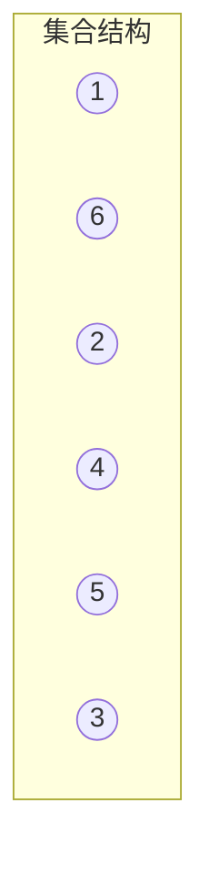
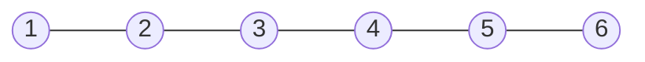
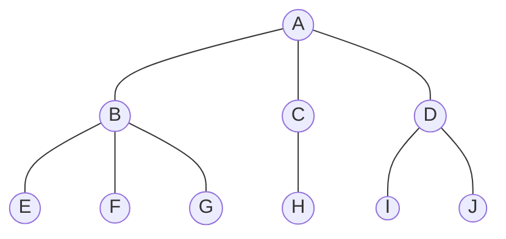
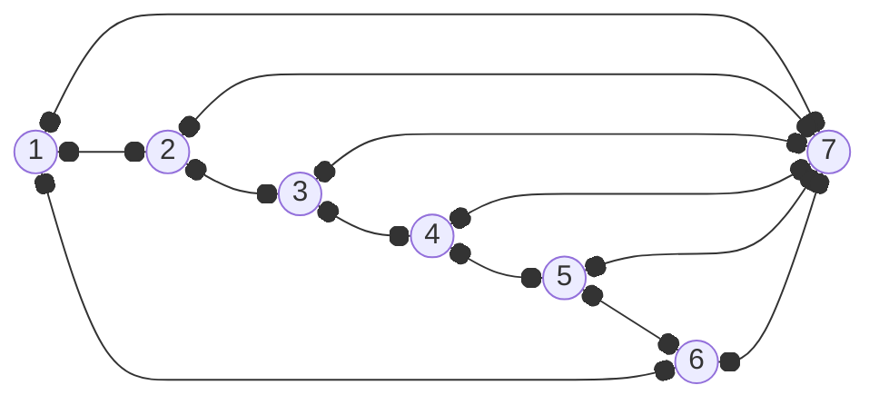
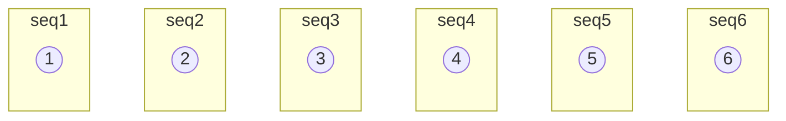
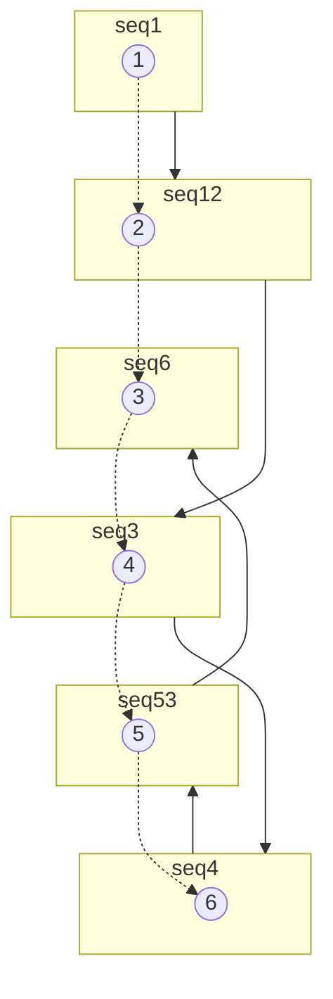
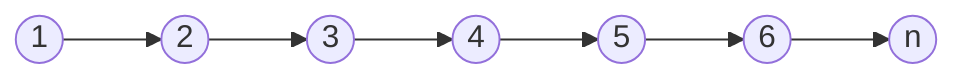

# 1 数据结构绪论

## 1.4 基本概念和术语

### 1.4.1 数据
数据是描述客观事物的符号，是计算机中可以操作的对象，是能被计算机识别并输入给计算机处理的符号合集。

### 1.4.2 数据元素
数据元素是组成数据的、有一定意义的基本单位，在计算机中通常作为整体处理，也被称为记录。

### 1.4.3 数据项
数据项：一个数据元素可以由若干个数据项组成。<br>
人是数据元素，人由眼睛、耳朵、手脚等等这些数据项组成。<br>
数据项是不可分割的最小单位。<br>

### 1.4.4 数据对象
数据对象是性质相同的数据元素的集合，是数据的子集。<br>
人类是数据对象，人类由所有人组成。<br>

### 1.4.5 数据结构
不同数据元素之间不是独立的，而是存在特定的关系，我们将这些关系称为结构。<br>
数据结构：是相互之间存在一种或多种特定关系的数据元素的集合。<br>

## 1.5 逻辑结构和物理结构

逻辑结构面向问题，物理结构面向计算机。<br>

### 1.5.1 逻辑结构

逻辑结构：是指数据对象中数据元素之间的相互关系。<br>

1. **集合结构**<br>
集合结构：集合结构中的数据元素除了同属于一个集合外，他们之间没有其他关系。<br>


2. **线性结构**<br>
线性结构：线性结构中的数据元素之间是一对一的关系。<br>


3. **树形结构**<br>
树形结构：树形结构中的数据元素之间存在一种一对多的层次关系。<br>


4. **图结构**<br>
图结构：图结构的数据元素是多对多的关系。<br>


### 1.5.2 物理结构
物理结构：是指数据的逻辑结构在计算机中的存储形式。<br>

1. **顺序存储结构**<br>

顺序存储结构：是把数据元素存放在任意的存储单元里，这组存储单元可以是连续的，也可以是不连续的。<br>


2. **链式存储结构**<br>

链式存储结构：是把数据元素存放在连续的存储单元里，但数据间的逻辑关系和物理关系不是一致的。<br>


## 1.6 数据类型

数据类型：是指一组性质相同的值的集合及定义在此集合上的一些操作的总称。

### 1.6.1 数据类型的定义

在C语言中，按照取值的不同，数据类型可以分为两类：<br>
- **原子类型**<br>
  不可以再分解的基本类型、包括整型、实型、字符型。

- **结构类型**<br>
  由若干个类型组合而成，是可以再分解的。<br>

抽象是指抽取出事物具有的普遍性的本质。

### 1.6.2 抽象数据类型

抽象数据类型（Abstract Data Type，ADT）：一个数学模型及定义在该模型上的一组操作。<br>

抽象数据类型体现了程序设计中问题分解、抽象和信息隐藏的特性。<br>

```
ADT 抽象数据类型名
Data
  数据元素之间逻辑关系的定义

Operation
  操作1
  ...
  操作n
endADT
```

## 1.7 总结

<center>

</center>

数据结构是相互之间存在一种或多种特定关系的数据元素的集合。<br>
<center>

</center>

# 2 算法

## 2.4 算法的定义

算法是解决特定问题求解步骤的描述，在计算机中表现为指令的有限序列，并且每条指令表示一个或多个操作。<br。

## 2.5 算法的特性
算法有五个基本特性：输入、输出、有穷性、确定性、可行性。<br>

### 2.5.1 输入、输出

算法具有零个或多个输入。算法至少有一个或多个输出。

### 2.5.2 有穷性

有穷性：指算法在执行有限的步骤之后，自动结束而不会出现无限循环，并且每一个步骤在可接受的时间内完成。<br>

### 2.5.3 确定性

确定性：算法的每一步骤都具有确定的含义，不会出现二义性。<br>

### 2.5.4 可行性

可行性：算法的每一步都必须是可行的，也就是说，每一步都能够通过执行有限次数完成。<br>

## 2.6 算法设计的要求

正确性、可读性、健壮性、时间效率高和存储量低。<br>

### 2.6.1 正确性

算法的正确性是指算法至少应该具有输入、输出和加工处理无歧义性，能正确反应问题的需求，能够得到问题的正确答案。<br>

大体分为四个层次：
- 算法程序没有语法错误
- 算法程序对于合法的输入数据能够产生满足要求的出结果
- 算法程序对于非法输入数据能够产生错误信息
- 算法程序对于精心选择的，甚至刁难的测试数据都有满足要求的输出结果

### 2.6.2 可读性

算法设计的另一目的是为了便于阅读、理解和交流。<br>

### 2.6.3 健壮性

当输入不合法数据时，算法能够做出相关处理，而不是发生异常或莫名其妙的结果。<br>

### 2.6.4 时间效率高和存储量低

算法应该尽量满足时间效率高和存储量低的要求。<br>

## 2.7 算法效率的度量方法

### 2.7.1 事后统计法

通过设计好的测试程序和数据，利用计算机计时器对不同算法编制的程序的运行时间进行比较，从而确定算法效率。<br>
缺陷：
- 花费大量时间和精力
- 比较容易受硬件和软件环境影响
- 算法的测试数据设计困难

这种方法不考虑采纳。<br>

### 2.7.2 事前分析估算法

在程序编制前，依据统计方法队算法进行估量。<br>

程序在计算机上运行消耗的时间主要取决于以下因素：
- 算法采用的策略、方法
- 编译产生的代码质量
- 问题的输入规模
- 机器执行指令的速度

一个程序运行时间，依赖于算法的好坏和问题的输入规模。<br>

## 2.8 函数的渐近增长

给定两个函数f(n)和g(n)，如果存在一个整数N，使得对于所有的n>N，f(n)总是比g(n)大，那么我们说f(n)的增长渐近快于g(n)。<br>

判断一个算法的效率时，函数中的常数和其他次要项常常可以忽略，而更因该关注主项（最高阶项）的阶数。<br>

## 2.9 算法时间复杂度

### 2.9.1 时间复杂度定义

在进行算法分析时，语句宗的执行次数T(n)是关于问题规模n的函数，进而分析T(n)随n的变化情况确定T(n)的数量级。算法的时间复杂度也就是算法的时间量度，记作T(n)=**O**(f(n))。他表示随问题规模n的增大，算法执行时间的增长率和f(n)的增长率相同，称作算法的渐近时间复杂度，简称为时间复杂度。其中f(n)是问题规模n的某个函数。<br>

用大写**O**()来体现算法时间复杂度的记法，我们称为大**O**记法。<br>

### 2.9.2 推导大O阶方法

推导大O阶：
- 用常熟1取代运行时间中的所有加法常数。
- 再修改后的运行次数函数中，只保留最高阶项
- 如果最高阶项存在且系数不是1，则去除与整个项相乘的系数。得到的结果就是大O阶

### 2.9.3 常熟阶

不管这个常量是多少，我们都记作O(1)，而不是O(3)、O(12)等其他任何数字。

### 2.9.4 线性阶

分析算法的复杂度，关键就是要分析循环结构的运行情况。<br>

### 2.9.5 对数阶

```c
int count = 1;
while(count <= n)
{
  count *= 2;
}
```
由2^x = n得到x=log2(n)，得到时间复杂度O(log2n)。

### 2.9.6 平方阶

```c
int i, j;
for(i = 0; i < n; i++)
{
  for(j = i; j < n; j++)
  {
    printf("i=%d, j=%d\n", i, j);
  }
}
```

由于当i=0时，内循环执行了n次，当i=1时，内循环执行n-1次，当i=n-1时执行了1次...以此类推，执行的总次数为：<br>
n+n-1+n-2+...+1+0=n*(n+1)/2<br>
没有常数项，保留最高阶项得到n^2/2，去除常数项系数为O(n^2)。<br>

## 2.10 常见的时间复杂度

|执行次数|阶|非正式术语|
|:---:|:---:|:---:|
|12|O(1)|常熟阶|
|2n+3|O(n)|线性阶|
|3n^2+2n+1|O(n^2)|平方阶|
|5log2(n)+20|O(logn)|对数阶|
|2n+3nlog2(n)+19|O(nlogn)|对数线性阶|
|6n^3+2n^2+3n+4|O(n^3)|立方阶|
|2^n|O(2^n)|指数阶|

O(1) < O(logn) < O(n) < O(nlogn) < O(n^2) < O(n^3) < O(2^n) < O(n!) < O(n^n)

## 2.11 最坏情况与平均情况

平均运行时间是所有情况中最有意义的，因为他是期望的运行时间。一般在没有特殊说明的情况下，都是指最坏时间复杂度。<br>

## 2.12 算法空间复杂度

算法空间复杂度的计算公式记作：S(n)=O(f(n))，其中，n为问题规模，f(n)为语句关于n所占存储空间的函数。<br>

# 3 线性表

## 3.2 线性表的定义

线性表（List）：是具有相同类型的元素，并且按一定的次序排列的集合。<br>



除了头节点，每个节点都只有一个前驱节点，除了尾节点，每个节点都只有一个后继节点。

在复杂的线性表中，一个数据元素可以由若干个数据项组成。<br>
```c
struct student {
  int sno;
  char name[20];
  char sex;
  int age;
};
```

## 3.3 线性表的抽象数据类型

线性表的抽象数据类型ADT：<br>
```
ADT 线性表（List）

Data
  线性表的数据对象集合为{a1, a2, ..., an}，每个元素的类型均为DataType。其中，除了头节点，每个节点都只有一个前驱节点，除了尾节点，每个节点都只有一个后继节点。数据元素之间的关系是一对一。

Operation
  InitList() 初始化一个空的线性表
  DestroyList(L) 销毁线性表L
  ClearList(L) 清空线性表L
  ListEmpty(L) 判断线性表L是否为空
  ListLength(L) 返回线性表L的长度
  GetElem(L, i, *e) 返回线性表L中第i个元素的值，即e
  LocateElem(L, e) 返回线性表L中与e值相同的元素的位序，如果找不到则返回0
  ListInsert(*L, i, e) 在线性表L中第i个元素之前插入元素e
  ListDelete(*L, i, *e) 在线性表L中删除第i个元素，并返回删除元素的值

endADT
```

>注意：当你传递一个参数给函数的时候，这个参数会不会在函数内被改动决定了使用什么参数形式。<br>
如果需要被改动，则需要传递指向这个参数的指针<br>
如果不需要被改动，可以直接传递这个参数<br>

## 3.4 线性表的顺序存储结构

### 3.4.1 顺序存储定义

线性表的顺序存储结构，指的是用一段地址连续的存储单元一次存储线性表的数据元素。<br>

<center>

</center>

### 3.4.2 顺序存储方式

在C语言中可以使用一维数组来实现顺序存储结构。<br>
```c
// 存储空间分配
#define MAXSIZE 100

typedef int ElemType;
typedef struct {
  // 存储数据元素
  ElemType data[MAXSIZE];
  // 线性表当前长度
  int length;
}SqList;
```

描述顺序存储结构需要三个属性：
- 存储空间的起始位置：数组data，它的存储位置就是存储空间的位置
- 线性表的最大存储容量：MAXSIZE
- 线性表的当前长度：length

### 3.4.3 数据长度和线性表长度的区别

线性表的长度是线性表当前存储的元素个数，而数据长度是线性表存储空间的长度。<br>

### 3.4.4 地址计算方法

存储器中的每个存储单元都有自己的编号，这个编号称为地址。<br>

LOC表示获得存储位置的函数。每个元素占据c个存储单元<br>

LOC(ai+1) = LOC(ai) + c<br>

LOC(ai) = LOC(a1) + (i-1)*c<br>

顺序表的存取性能为O(1)，我们通常把具有这一特点的存储结构称为随机存取结构。<br>

## 3.5 顺序存储的插入与删除

### 3.5.1 获得元素

```c
#define OK 1;
#define ERROR 0;
typedef int Status;
// 操作结构：获取L中第i个元素，数组下标从0开始
Status GetElem(SqList L, int i, ElemType *e) {
  if(L.length == 0 || i < 1 || i > L.length) 
    return ERROR;
  *e = L.data[i-1];
  return OK;
}
```

### 3.5.2 插入元素

插入算法的思路：
- 插入位置不合理抛出异常
- 如果插入后线性表的长度大于线性表最大存储容量，则抛出异常或动态增加容量
- 从最后一个元素开始向前遍历到第i个位置，分别将它们向后移动一个位置
- 将第i个位置的元素设置为e
- 线性表长度加1

```c
Status ListInsert(SqList *L, int i, ElemType e) {
  int k;
  if(L->length == MAXSIZE) 
    return ERROR;
  if(i < 1 || i > L->length+1) 
    return ERROR;
  if(i <= L->length) {
    for(k = L->length; k >= i; k--) {
      L->data[k + 1] = L->data[k];
    }
  }
  L->data[i-1] = e;
  L->length++;
  return OK;
}

```

### 3.5.3 删除元素

删除算法思路：
- 删除位置不合理抛出异常
- 取出删除元素
- 从删除位置开始遍历到最后一个元素位置，分别将它们向前移动一个位置
- 线性表长度减1

```c
Status ListDelete(SqList *L, int i, ElemType *e) {
  int k;
  if(L->length == 0 || i < 1 || i > L->length)
    return ERROR;
  *e = L->data[i-1];
  if(i < L->length) {
    for(k = i; k < L->length; k++) {
      L->data[k-1] = L->data[k];
    }
  }
  L->length--;
  return OK;
}
```

### 3.5.4 线性表顺序存储结构的优缺点

优点：
- 无需为表示表中元素之间的逻辑关系而增加额外的存储空间
- 可以快速的存取表中任一位置的元素

缺点：
- 插入和删除操作需要移动大量元素，时间复杂度O(n)
- 线性表长度有限，当长度达到最大值时，无法再插入新元素
- 当线性表长度变化较大时，难以确定存储空间的容量
- 造成存储空间的碎片化

## 3.6 线性表的链式存储结构

### 3.6.2 线性表链式存储结构的定义

线性表的链式存储结构的特点是用一组任意的存储单元存储线性表的数据元素。这组存储单元可以是连续的，也可以是不连续的。<br>
存储数据元素信息的域称为**数据域**，存储直接后继位置的域称为**指针域**。指针域中存储的信息称作**指针**或**链**。这两部分信息组成数据元素的存储映像，称为**节点**（Node）<br>

n个节点链接成一个链表，即为线性表（a1,a2..an)的链式存储结构，因为此链表的每个节点中只包含一个指针域，所以叫做**单链表**。<br>
<center>

</center>

链表中第一个节点的存储位置叫做头指针，在单链表的第一个节点前附设一个节点称为头节点。头节点的数据域不存储任何信息。<br>

### 3.6.3 头指针与头节点的异同

**头指针**：
- 头指针是链表指向第一个节点的指针，若链表有头节点，则是指向头节点的指针
- 头指针具有标志作用，所以常用头指针冠以链表的名字
- 无论链表是否为空，头指针均不为空。头指针是链表的必要元素

**头节点**：
- 头节点是为了操作的统一和方便而设立的，放在第一元素的节点之前，其数据域一般无意义（也可存放链表长度）
- 有了头节点，对在第一元素节点前插入节点和删除第一节点，其操作与其他节点的操作就统一了
- 头节点不一定是链表必需要素

### 3.6.4 线性表链式存储结构代码描述

带有节点的单链表
<center>

</center>

```c
typedef struct LNode {
  ElemType data;
  struct LNode *next;
} NODE;
typedef NODE *LinkList;
```

## 3.7 单链表的读取

获取链表第i个数据的算法思路：
- 声明一个指针p指向链表的第一个节点，初始化j从1开始
- 当j&lt;i时，就遍历链表，让p的指针向后移动，不断指向下一节点，同时j++
- 若到链表末尾p为空，则说明第i个节点不存在
- 查找成功返回节点p的数据

```c
Status GetElem(LinkList L, int i, ElemType *e) {
  int j = 1;
  LinkList p = L->next;
  while(p && j < i) {
    p = p->next;
    ++j;
  }
  if(!p || j > i)
    return ERROR;
  *e*e = p->data;
  return OK;
}
```

## 3.8 单链表的插入与删除

### 3.8.1 插入操作

单链表第i个数据插入节点的算法思路：
- 声明一个指针p指向链表的头节点，初始哈j从1开始
- 当j&lt;i时，就遍历链表，让p的指针向后移动，不断指向下一节点，同时j++
- 若到链表末尾p为空，则说明第i个节点不存在
- 否则查找成功，在系统中生成一个空节点s
- 将数据元素e赋值给s-&gt;data
- 将s-&gt;next=p-&gt;next; p-&gt;next=s;
- 返回成功

```c
Status ListInsert(LinkList *L, int i, ElemType e) {
  int j = 1;
  LinkList p = *L, s;
  // 寻找节点i
  while(p && j < i) {
    p = p->next;
    ++j;
  }
  // 第i个节点不存在
  if(!p || j > i) 
    return ERROR;
  s = (LinkList)malloc(sizeof(NODE));
  s->data = e;
  s->next = p->next;
  p->next = s;
  return OK;
}
```

### 3.8.2 删除操作

单链表第i个数据删除节点的算法思路：
- 声明一个指针p指向链表的头节点，初始哈j从1开始
- 当j&lt;i时，就遍历链表，让p的指针向后移动，不断指向下一节点，同时j++
- 若到链表末尾p为空，则说明第i个节点不存在
- 否则查找成功，将欲删除的节点赋值给q，q=p-&gt;next;
- 单链表的删除语句，p-&gt;next=q-&gt;next;
- 释放节点q的内存，返回成功

```c
Status ListDelete(LinkList *L, int i, ElemType *e) {
  int j = 1;
  LinkList p = *L, q;
  while(p->next && j < i) {
    p = p->next;
    ++j;
  }
  if(!(p->next) || j > i) {
    return ERROR;
  }
  q = p->next;
  p->next = q->next;
  *e = q->data;
  free(q);
  return OK;
}
```

## 3.9 单链表的整表创建

单链表的整表创建的算法思路：
- 声明一个指针p和计数器变量i
- 初始化空链表L
- 让L的头节点的指针指向NULL，即建立一个带头节点的单链表
- 循环：
  - 生成新节点赋值给p
  - 随机生成数字赋值给拍的数据域p-&gt;data
  - 将p插入到头节点与前一新节点之间

```c
// 随机生成n个节点，建立带表头节点的链表（头插法）
void CreateListR(LinkList *L, int n) {
  LinkList p;
  int i;
  // 初始化随机数种子
  srand(time(0));
  *L = (LinkList)malloc(sizeof(NODE));
  (*L)->next = NULL;
  for(i = 0; i < n; i++) {
    p = (LinkList)malloc(sizeof(NODE));
    p->data = rand() % 100 + 1;
    p->next = (*L)->next;
    (*L)->next = p;
  }
}
```

```c
// 尾插法
void CreateListH(LinkList *L, int n) {
  LinkList p, r;
  int i;
  *L = (LinkList)malloc(sizeof(NODE));
  r = *L;
  for(i = 0; i < n; i++) {
    p = (LinkList)malloc(sizeof(NODE));
    p->data = rand() % 100 + 1;
    r->next = p;
    r = p;
  }
  r->next = NULL;
}
```

## 3.10 单链表的整表删除

单链表的整表删除的算法思路：
- 声明一个指针p和q
- 将第一个节点赋值给p
- 循环：
  - 将p的下一个节点赋值给q
  - 释放节点p的内存
  - p=q

```c
void DestroyList(LinkList *L) {
  LinkList p, q;
  p = (*L)->next;
  while(p) {
    q = p->next;
    free(p);
    p = q;
  }
  (*L)->next = NULL;
  free(*L);
  *L = NULL;
}
```

## 3.11 单链表结构与顺序存储结构的优缺点

| 类型 |存储分配方式|时间性能|空间性能|
|:---|:---|:---|:---|
|顺序存储|采用一段连续存储单元依次存储线性表的数据元素|查找O(1)；插入和删除O(n)|需要预分配存储空间，分大了浪费，小了容易溢出|
|链式存储|用一组任意的存储单元存放线性表元素|查找O(n)；插入和删除O(1)|只要有就可以分配空间，元素个数不限制|

若线性表需要频繁查找，很少进行插入和删除操作时，宜采用顺序存储结构。<br>
若线性表中的元素个数变化较大或者根本不知道有多大时，宜采用链式存储结构。<br>

## 3.12 静态链表

用数组描述的链表叫做**静态链表**<br>

```c
#define MAXSIZE 100
typedef struct {
  ElemType data;
  int cur;
} Component, StaticLinkList[MAXSIZE];
```

下图是空静态链表：
<center>

</center>

```c
Status InitList_S(StaticLinkList L) {
  int i;
  for(i = 0; i < MAXSIZE - 1; i++) {
    L[i].cur = i + 1;
  }
  L[MAXSIZE - 1].cur = 0;
  return OK;
}
```

下图是存放了数据的静态链表：
<center>

</center>

### 3.12.1 静态链表的插入

将所有未被使用过的以及已经被删除的分量用游标链成一个备用的链表，每当进行插入时，便可以从备用链表上取得第一个节点作为待插入的新节点。<br>
```c
int Malloc_SSL(StaticLinkList L) {
  int i = L[0].cur;
  if(L[0].cur) {
    L[0].cur = L[i].cur;
  }
  return i;
}
```

插入实现代码：
```c
Status ListInsert_S(StaticLinkList L, int i, ElemType e) {
  int j = 1, k, l;
  k = MAXSIZE - 1;
  if(i < 1 || i > ListLength_S(L) + 1) {
    return ERROR;
  }
  j = Malloc_SSL(L);
  if(j) {
    L[j].data = e;
    for(l = 1; l < i; l++) {
      k = L[k].cur;
    }
    L[j].cur = L[k].cur;
    L[k].cur = j;
    return OK;
  }
  return ERROR;
}
```

- 当我们执行插入语句时，我们的目的是要在“b”和“d”之间插入“c”。调用代码时，输入i值为3.
- 第四行让k=MAX_SIZE-1=999。
- j=Malloc_SSL(L)，此时下标为0的cur也要因为7要被占用而更改备用链的值为8。
- for循环由1到2，执行两次。代码`k=L[k].cur`使得k=999，得到`k=L[999].cur=1`，在得到`k=L[1].cur=2`
- `L[j].cur=L[k].cur=`，因为j=7，而k=2得到`L[7].cur=L[2 ]`
- `L[k].cur=j`，意思就是`L[2].cur=7`

<center>

</center>

### 3.12.2 静态链表的删除

实现释放节点：
```c
void Free_SSL(StaticLinkList L, int i) {
  L[i].cur = L[0].cur;
  L[0].cur = i;
}
```

删除实现代码：
```c
Status ListDelete_S(StaticLinkList L, int i) {
  int j = 1, k;
  if(i < 1 || i > ListLength_S(L)) {
    return ERROR;
  }
  for(j = 1; j < i; j++) {
    k = L[k].cur;
  }
  j = L[k].cur;
  L[k].cur = L[j].cur;
  Free_SSL(L, j);
  return OK;
}
```

<center>

</center>

代码中`ListLength_S(L)`的实现代码：
```c
int ListLength_S(StaticLinkList L) {
  int j = 0;
  int i = L[MAXSIZE - 1].cur;
  while(i) {
    i = L[i].cur;
    ++j;
  }
  return j;
}
```

### 3.12.3 静态链表的优缺点

- 优点：
  在插入和删除操作时只需要修改游标，不需要移动元素，从而改进了在顺序存储结构中插入和删除操作需要移动大量元素的缺点<br>
- 缺点：
  没有解决连续分配带来的表长难以确定的问题<br>
  失去了链式存储结构随机存取的特性<br>


## 3.13 循环链表

头尾相连的单链表称为单循环链表，简称循环链表（circular linked list）<br>

## 3.14 双向链表

# 4 栈与队列

# 5 串

# 6 树

# 7 图

# 8 散列

# 9 查找

# 10 排序
